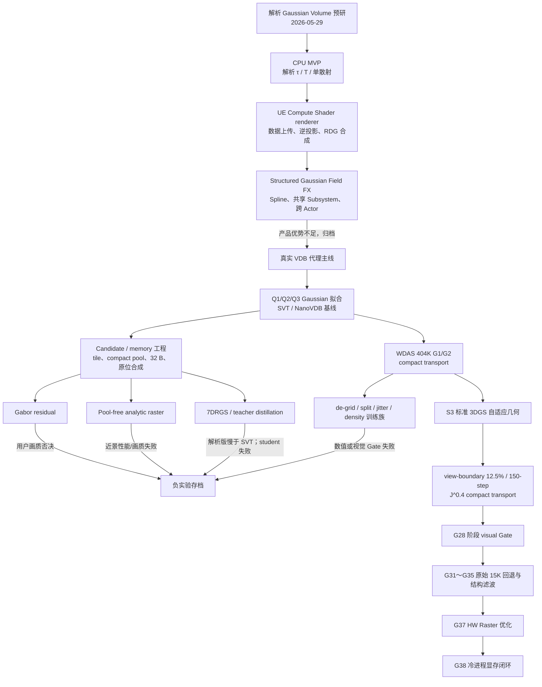

# GaussianVolume 项目技术路线、失败分支与最终成果总览

> 汇总范围：2026-05-29 立项至 2026-07-31 G38 性能/显存收尾。  
> 当前事实源：`AI-BRIEF.md`、`SPEC.md`、`LOG.md`、`BACKLOG.md`、
> `IMPLEMENTATION-AND-OPTIMIZATION-LEDGER.md`。  
> 本文是项目导航与复盘，不替代追加式实验记录和原始证据。

## 0. 一页结论

GaussianVolume 从“验证解析 ray-Gaussian 体积积分是否值得做”起步，经历了 CPU
原型、UE Compute Shader、Structured Gaussian Field FX、真实 VDB 拟合、紧凑
candidate renderer、Gabor residual、7DRGS、固定预算 404K 去网格和标准 3DGS
几何等多轮路线切换。

最终冻结成果不是通用 VDB 替代器，也不是近景 Hero renderer，而是一条范围明确的
中远景静态云生产链：

> VDB teacher → 标准 3DGS 15K 自适应几何 → 12.5% view-boundary、
> 150-step 轮廓候选 → 单记录 shared-opacity 六轴 `J^0.4` 静态 transport →
> UE GPU preprocess / sort / HW Quad / composite / DGSM / phase。

最终 G35/G37 已通过中景、远景 visual Gate，冻结资产为标准 3DGS 15K 原始 geometry/opacity +
VDB direct `J^0.4` transport，`311,993` 点、`64 B/point`、primitive payload
`19.043 MiB`。G37 同帧 feature-time 为 GS/SVT=`1.093/3.241 ms`；G38 冷进程测得
单体积净新增 RHI working set 为 GS/SVT=`66.476/305.566 MiB`。当前已证明在已签字的
UE SVT 中远景 A/B 窗口内 GS 更快且体积资源更小；尚未扩展到 NanoVDB、Shipping、近景 Hero
或通用 VDB 替代。

## 1. 目标如何演变

### 1.1 最初问题

立项时只回答三个工程问题：

1. Gaussian volume primitives 能否形成连续体积感；
2. 每个 primitive 一次解析 optical-depth 积分能否替代固定步 raymarch；
3. traversal 与每像素 candidate 数能否控制。

第一版明确不做完整 VDB 拟合、多次散射、通用资产系统或产品化框架。

### 1.2 中期产品假设

解析内核在 UE 打通后，项目一度转向 Structured Gaussian Field FX，尝试用 spline
生成极光、能量丝带、魔法轨迹等方向性体积带，并让同一 field 同时服务渲染、光照
衰减和 density query。

该方向完成了共享 World Subsystem、跨 Actor 合并、逐 ray 排序、HDR 合成和
跨 primitive 光照，但最终因为缺乏相对 Niagara/普通 raymarch 的独特生产优势，
于 2026-07-22 从主线移除。

### 1.3 最终合同

最终问题收缩为：

> 在 UE 5.8、RTX 5060、1920×1080、中远景、静态单 density 云、一盏方向光
> 加 SkyLight 的限定窗口内，Gaussian 表示能否在匹配屏幕 optical depth、
> transmittance、轮廓和细节后，以更低总运行成本显示同源 VDB？

“总运行成本”必须包括完整帧、volume pass、稳态和峰值 working set、transient、
排序/可见性/光照/合成等资源；磁盘 PLY 或 primitive buffer 大小不能代替最终结论。

## 2. 路线总图



## 3. 按时间展开的技术路线

### 阶段 A：解析体积 MVP（2026-05-29 ～ 2026-06-05）

**假设**

- 使用有限区间 erf 解析积分计算每个 Gaussian 对 ray 的 optical depth；
- 以 front-to-back single scattering 得到体积颜色和 transmittance；
- 先验证结构，再讨论 VDB 转换与 GPU。

**实现**

- `mvp/` 纯 NumPy CPU renderer；
- 手工 Gaussian cloud；
- view ray 和 light ray 均使用解析积分；
- bounding-sphere candidate 与 early termination。

**结果**

- `N=1024` 得到连续体积感，解析 transmittance 成立；
- brute-force candidate/ray 约占总 primitive 的 `45%`，traversal 被确认是首个瓶颈。

### 阶段 B：CPU 加速与方法交叉阅读（2026-07-07）

**尝试**

- uniform grid + Amanatides-Woo DDA；
- 光方向 tau 矩阵预计算；
- Numba 全管线并行；
- VoGE、Vol3DGS、3DGEER 横向审计；
- dense/VDB → Gaussian 转换器。

**关键结论**

- uniform grid 在密集云上只减少被测试 primitive，不减少真实 candidate，
  且 Python/Numba DDA 开销反而更大；
- 预计算光方向 tau 矩阵把 NumPy 路径加速 `6.7×`；
- Numba 修复 `prange` 共享 buffer 竞争后达到约 `76 万 ray/s`；
- 3DGEER 的 PBF/tile association 比通用 BVH 更适合后续 UE GPU 路线；
- 每 primitive 有限区间解析积分是本项目相对普通 splat 的核心数学资产。

### 阶段 C：UE renderer 从零打通（2026-07-08 ～ 2026-07-10）

**基础架构**

- Runtime plugin；
- `UGaussianVolumeComponent` / `AGaussianVolumeActor`；
- Global Compute Shader + RDG；
- CPU packing → render command → StructuredBuffer；
- SceneViewExtension 后处理合成。

**主要根因修复**

1. SM6 无 `erf()` intrinsic：改用 Abramowitz-Stegun 近似；
2. 写在 tonemap 前的结果被后处理覆盖：迁到标准 post-process callback；
3. 手工 FOV/aspect/camera basis 不可靠：改为 UE `ClipToWorld` 逆投影；
4. reverse-Z 的 `z=0` 是无限远，除以 `w=0` 产生 NaN：改用 `z=1` 与 `z=0.5`
   两个有限点生成 ray；
5. Actor 变换未重传：增加编辑器移动后的数据更新。

**阶段结果**

- 调试球正圆、世界空间稳定、可移动；
- 解析 single scattering、powder、ambient 和场景合成跑通；
- UE 端核心渲染闭环成立。

### 阶段 D：Structured Gaussian Field FX（2026-07-10 ～ 2026-07-22）

**实现过的能力**

- Spline → Gaussian field；
- 多 Actor 合并到 World Subsystem 的单一 SVE/pass；
- 每 ray 以 `t_star` 排序，而不是使用全屏 CPU 中心深度序；
- SceneDepth 遮挡；
- HDR、bloom 前合成；
- 跨 primitive light tau；
- density probe 作为第二消费者；
- 64-hit 有界工作集。

**退出原因**

- 多个正确性和架构问题虽已修复，但产品差异最终依赖展示叙事；
- 未形成相对 Niagara Ribbon、普通 raymarch 或 3D texture 的明确可测优势；
- 继续完善会扩张成另一个产品问题，偏离 VDB proxy 的正向作品集目标。

**裁决**

- 2026-07-22 主线移除；
- 渲染内核、Subsystem、逐 ray 排序和共享 field 经验保留；
- 规格和产品方向存入 `notes/archive/`。

### 阶段 E：真实 VDB、candidate renderer 与产品基线（2026-07-21 ～ 2026-07-24）

**数据链**

- Meta `volumetric_primitives` 官方 smoke PLY；
- UE 5.8 OpenVDB `smoke2.vdb`；
- VDB → dense/聚合 → Gaussian JSON/PLY；
- 同源 UE SVT U8/F16；
- NanoVDB Fp8/FpN + PNanoVDB HLSL + HDDA。

**渲染演进**

- 全屏逐 primitive：835 点已约 `23.31 ms` 主 pass；
- 32×32 tile candidate；
- 10K/30K 自适应 VDB 档；
- 屏幕尺寸 LOD 与过渡；
- count → prefix → scatter 紧凑全局 candidate pool；
- candidate overflow telemetry；
- 32 B local-space primitive；
- 原位 SceneColor 合成；
- 1/4/16 平移实例共享；
- Editor/non-UAV SceneColor 安全回退；
- `GaussianVolume` 顶层 GPU stat。

**工程结论**

- 瓶颈从“全局 primitive 数”转为“每 tile/像素实际 overlap”；
- 固定容量必须显式报告 overflow，不能用静默截断制造假性能；
- Editor Details 展开、RHI allocation 粒度和正式 `-game` working set 必须与
  renderer 本体分开取证；
- 内存优化曾把 Q2 compact runtime 自定义资源压到约 `2.344 MiB`，但该数字
  不可直接沿用到最终 S3 的 64 B/point 和完整质量路径。

### 阶段 F：Q2/Q3、Gabor 与 pool-free 分叉（2026-07-23 ～ 2026-07-26）

#### Q2 / Q3

- Q2 导出 `9,944` primitives；
- 8 个 held-out 视角结果：
  full-T `48.60 dB`、foreground-T `36.93 dB`、τ `28.07 dB`、
  silhouette IoU `0.629`、negative-τ `0`；
- Q3 增至 `24,576` 点却相对 Q2 的 full/foreground-T/τ PSNR 分别下降
  `14.00/14.52/22.41 dB`，因此停止。

#### Gabor residual

- 最终为 `9,944 Gaussian + 4,096 Gabor`；
- step 1200 clean PSNR=`31.1498 dB`；
- 用户在 UE 中确认细节和整体观感太差；
- 不再继续灯光调参、运行时优化或性能 A/B。

#### Pool-free analytic raster

- 删除 candidate count/scan/scatter；
- full-res 解析光栅解决近景 tile 格；
- 0.5× R16F 累加总 τ，再全分辨率 resolve；
- 非贴脸可达到约 `0.60 ms` pass、`1.50 MiB` 命名资源；
- 真实贴脸 full-res `50+ ms`，0.5× 仍约 `25 ms` 且细节失败。

**裁决**

- 三条分支都留下了数值、显存或架构资产；
- Q3、Gabor、pool-free 均不进入最终画质主线。

### 阶段 G：7DRGS 与 teacher distillation（2026-07-25 ～ 2026-07-28）

**解析 7DRGS**

- 真实 `smoke2.vdb` 转为 `388,890` 个六方向叶片点；
- CGHEVEN Hero Congestus 50 的 B2 Ultra reference 为
  `1,112,674` 空间点、`6,676,044` 叶片点；
- 修复超过 D3D12 `65,535` dispatch group 的 wrapped dispatch；
- 接入 DirectionalLight refresh、SkyLight、Slice、Preprocess、Sort、HW Raster。

**性能**

- 同机位 7DRGS 完整帧/自身=`9.19/1.799 ms`；
- SVT U8 完整帧/HeterogeneousVolumes=`8.43/1.070 ms`；
- 解析 7DRGS 没有胜过 SVT。

**训练压缩**

- 15K student 虽然 finite，但 held-out foreground J/TView 只有
  `16.54/14.83 dB`；
- UE 画面表现为严重颗粒和模糊；
- 审计发现旧初始化丢失 opacity/J/TView/directional fields，light condition
  还能改变空间 covariance；
- 后续建立六叶片 teacher 聚合、固定几何/opacity/TView、只训练 light-conditioned
  `J` 的 1K smoke；
- degree-2 1K 数值候选和 H 系列 transport 实验完成，但未成为最终交付主线。

**裁决**

- B2 Ultra 作为质量 teacher 和运行时工程证据保留；
- 解析版性能负结论和失败 student 均归档；
- 不把 7DRGS 写成性能领先或完整论文训练复现。

### 阶段 H：50K 与 WDAS 404K 固定预算主线（2026-07-27 ～ 2026-07-30）

#### 50K compact 研究

- 有机矩收缩、progressive frequency supervision、extinction calibration；
- exact `50,000` 普通 Gaussian，不增加 runtime Gabor 字段；
- 建立相对 NanoVDB 的 resident/candidate/解析积分 break-even 模型；
- 多个 V3/V6/H9/H13 候选未完成最终用户 visual Gate，未替换最终路线。

#### WDAS 404K G1/G2

- G1：Balanced 404K，用户确认“效果好很多”，作为保底 Gate；
- G2：`sigma=0.38`、anisotropy boost=`1.15`，exact `404,524 × 64 B`；
- 修复六轴 `j_0..j_5` 与 Y/Z angular weights 错配；
- scene-light 直接消费 UE/SkyAtmosphere 解析后的方向光颜色；
- compact transport、DGSM、phase 和日落光色链路形成稳定参考。

#### 去网格实验族

围绕 G2 规则 B8 点阵，系统穷举了：

- center jitter、moment-balanced jitter、blue noise、center warp；
- covariance rotation、covariance/extinction-only；
- exact split/merge、多尺度 moment、stratified density；
- Adaptive B4；
- Density De-grid P0/P1/P2/P2b/P2c；
- Sigma8 `3.236M` 点；
- footprint、PreTSR、AlphaCutoff 和 screen blur。

这些方法能够降低 lattice-order，但总是把点阵换成颗粒、斜纹、闪烁、造型漂移，
或显著损失 τ/T/edge/Gabor 指标。Sigma8 又使 GPU per-point buffer 增至约
`691.33 MiB`，工程价值明确失败。

**阶段结论**

- G1/G2 成为可恢复基线；
- 去网格不能在固定规则几何上靠扰动解决；
- 最终必须换成标准 3DGS 自适应 densify/prune 几何。

### 阶段 I：S3 标准 3DGS 与最终 G28（2026-07-30 ～ 2026-07-31）

**几何主线**

- 标准 3DGS 训练在 15K 得到 `311,993` 点；
- test L1=`0.00240468`、PSNR=`43.5372 dB`；
- 30K PSNR 回落到 `42.9078 dB`，判定过拟合；
- 把六轴 transport 转移到单记录 shared-opacity compact layout；
- 移除 baked DC 重复光照。

**收口实验**

- 精确 RGBA alpha、多尺度 silhouette fine-tune；
- 标准 `3σ` footprint 和 shared-opacity composite 审计；
- 4-NN transport、VDB 直接重烘、`J=1` 的 A/B/C；
- `J^0.5 / J^0.25 / J^0.4` 响应扫描；
- 6.25%、10%、12.5% view-boundary contributor；
- 100/150-step 小步训练；
- 自适应外缘 composite filter；
- internal-alpha 与 1.04× interior footprint。

**最终选择**

- 采用 `J^0.4`；
- 采用 12.5% view-boundary mask、150-step 候选；
- 维持 `311,993` 点、`64 B/point`；
- internal-alpha、统一 footprint 放大、强 AlphaCutoff、全图 blur 均回滚。

## 4. 失败分支总表

| 分支 | 原假设 | 失败证据 | 最终裁决 | 主要存档 |
|---|---|---|---|---|
| Uniform grid / DDA | 减少 traversal 即能加速 | 密集云真实 candidate 不减，DDA 循环更慢 | 保留研究代码，退出主线 | `mvp/`、`LOG.md` |
| Structured Gaussian Field FX | 同一 spline field 可形成独特 VFX 产品 | 相对 Niagara/raymarch 的优势不足，范围继续扩张 | 产品方向归档，保留 renderer 架构 | `notes/archive/failed_spline_*` |
| 全屏逐 primitive | 小规模 Gaussian 可直接 per-pixel 遍历 | 835 点主 pass 已约 `23.31 ms` | 被 tile/candidate 路线替换 | `LOG.md`、旧 Build/备份 |
| 固定 tile 表 / 静默截断 | 固定容量足以控制成本 | 自由镜头和贴脸出现整屏 32×32 格；overflow 可达 `837,884` | 必须紧凑池、telemetry、quality exact reference | `evidence/memory-*`、`evidence/perf-*` |
| Q3 24K | 增点应提升 Q2 质量 | 三项 PSNR 大幅下降 | 停止训练，Q2 保留 | `evidence/q3-120/` |
| Gabor residual | signed residual 可在低预算补高频 | 数值训练完成但 UE 用户画质否决 | 全线归档，不再优化 | Gabor 日志、JSON、训练输出 |
| Pool-free raster | 无 candidate 架构可同时解决格子与性能 | 贴脸 `50+ ms`；半分辨率仍约 `25 ms` 且画质失败 | 负实验保留 | `evidence/perf-20260724-poolfree-multirate/` |
| 解析 7DRGS | 六方向叶片可比 SVT 更快 | 自身 `1.799 ms`，慢于 SVT `1.070 ms` | 保留质量 teacher 和 UE 链，不宣称性能领先 | `artifacts/7drgs_real_vdb/`、`training/7drgs/` |
| 7DRGS 15K student | 训练可压缩 B2 Ultra | held-out 低、颗粒严重、细节模糊 | 禁止续跑/裁剪 | 7DRGS checkpoints、训练日志 |
| 50K organic/H 系列 | 低预算可闭环最终 Hero | 数值窗口存在，但最终 UE visual Gate 未关闭 | 研究资产保留，未成最终交付 | `artifacts/hero_*` |
| G3/G4 jitter de-grid | 小扰动可破坏 G2 lattice 且保持光学质量 | lattice 降幅越大，τ/T/edge 越差 | 全部否决 | `artifacts/wdas_404k_degrid_overnight/` 等 |
| Density De-grid | 自由中心和三维 supervision 可替代规则 B8 | lattice 几乎消失，但 global/ROI optical Gate 失败 | P0/P1 工具保留，P2 路线退役 | `artifacts/wdas_density_degrid/` |
| Covariance-only | 冻结中心只拉伸椭球即可去格 | 弱档不可见，强档 τ MAE 回退约 `4.49%` | 否决 | `artifacts/wdas_404k_covonly_freq_*` |
| Exact split/merge / Adaptive B4 | 固定 404K 下换多尺度结构 | 点阵转为颗粒/斜纹，光学指标明显落后 G2 | 禁止部署 | `artifacts/wdas_404k_adaptive_b4*` |
| Sigma8 | 八子点可消除格点 | `8×` 点数、约 `691.33 MiB` per-point GPU buffer，仍有放射纹 | 正式淘汰 | `artifacts/wdas_sigma_points_8/`、`evidence/g2_vs_sigma8_*` |
| S3 alpha fine-tune | 更低 alpha loss 会直接改善 UE | 离线更优但 UE 轮廓更碎或过拟合 | 原 15K geometry 保留 | `artifacts/wdas_s3_silhouette_*` |
| 大范围 composite blur | 屏幕空间模糊可解决结构轮廓 | 只改 1–2 px，无法解决 10–50 px 团块结构 | 禁止全图 RGB blur | `evidence/screen_resolve_blur_probe/` |
| S3 internal-alpha / 1.04× footprint | 平滑内部 opacity 可减少碎团 | 发白棉絮壳、硬暗缝和视角轮廓污染 | 完整回滚至 G25 | `artifacts/wdas_s3_internal_alpha_*` |

## 5. 最终冻结成果

### 5.1 G35/G37 冻结资产

插件内路径：

```text
Plugins/GaussianSplattingForUnrealEngine/Content/Data/
S3Original15KG32_20260731/
S3_Original15KGeometry_CurrentGamma04J_AngularSigma05.ply
```

结构：

- `311,993` 点；
- `64 B/point`；
- primitive payload=`19,967,552 B`，约 `19.043 MiB`；
- SHA256=`AE7177BF3753E9905C34208A9D46A2647018F55A49FF13581A717BA1040EA0FB`。

G24～G28 的 boundary-morph geometry 已从正式资产回滚，仅保留为历史视觉分支。

### 5.2 冻结运行参数

- opacity multiplier=`0.37666699`；
- opacity power=`1.0`；
- relight intensity scale=`0.105333`；
- ambient=`0.001`；
- DGSM density=`0.744534`，min transmittance=`0.0152`，contrast=`4.0`；
- phase mode/g/blend/intensity=`0 / 0.65 / 0.1 / 0.4`；
- G32 双侧结构 coverage 桥接、G33 轮廓切线与 G35 内部 joint bilateral 保持冻结；
- G37 只收缩 cutoff 外 alpha support quad，不改变保留像素；
- 不增加 point、pass、RT 或运行时网络。

完整可恢复参数以
`artifacts/runtime_interior_joint_bilateral_g35_20260731/frozen_visual_baseline.json` 为准，
不要从本节摘要手调恢复。

### 5.3 已经成立

- VDB teacher 到 UE compact PLY 的完整可复现链；
- 标准 3DGS 自适应几何消除了规则 B8 点阵主瑕疵；
- 中景/远景外轮廓、大尺度体积层次和连续边缘衰减通过用户 visual Gate；
- 一盏 Directional Light + SkyLight 下的静态重光照成立；
- GPU preprocess、排序、HW Quad、shared-opacity composite、DGSM、phase 链成立；
- G35 为只读视觉回归基线，G37 为当前 runtime 基线；G25/G28 只作历史回滚证据。

### 5.4 尚未成立

- 近景 Hero 质量；
- 动画、多光源、动态 GI、通用 VDB 替代；
- 相对 NanoVDB 的同质量 GPU/working-set 优势；
- Shipping build 的正式 10+10 GPU headline；
- 多资产、动画与近景 Hero 的扩展结论。

当前 UE SVT A/B 已成立：同帧 feature-time SVT/GS=`3.241/1.093 ms`；单体积净新增
RHI working set SVT/GS=`305.566/66.476 MiB`。`19.043 MiB` 仍只表示 PLY payload；
`2343.980 MiB` 则是整个 GS 测试进程，均不得冒充单个 GS 完整显存。

## 6. 性能优化与显存闭环

### G22：HW Quad 死缓冲

- 删除已无消费者的 `TilesTouched / VisibleRectMin / VisibleRectMax`；
- 固定 `311,993` 点时，每视图减少 `3,743,916 B`，约 `3.570 MiB` transient；
- 减少 Preprocess 三次初始化写、三次结果写和无用 tile-rect 运算；
- 冷编译和 DX12 离屏启动通过；
- 仍需前台同机位 profile。

### G23：Radix sort clear

- `SortKeys0` 与备用侧 RDG 初始化仍为正确性所需；
- 最终只删除已证明冗余的 `SortValues0` clear；
- 约节省 `0.005 ms/帧`；
- 冷编译和 300 帧 DX12 验证通过。

### G37：alpha-support quad crop

- 按 PS 已有 `AlphaCutoff=1/255` 收缩仍可能贡献的 quad，保留 `0.05σ` 余量；
- GS total `1.343→1.093 ms`（`-18.6%`），HW Raster `0.819→0.5665 ms`
  （`-30.8%`）；G35 composite 与视觉链不变；
- 用户自由镜头复验通过，晋升当前 runtime 基线。

### G38：冷启动显存

- Empty/SVT/GS 各 3 个独立 Development `-game` 冷进程，D3D12、1920×1080；
- 整进程专用显存中位数 SVT/GS=`2664.178/2343.980 MiB`，GS 少
  `320.198 MiB / 12.019%`；
- 单体积净新增 RHI SVT/GS=`305.566/66.476 MiB`，GS 少
  `239.090 MiB / 78.245%`，约小 `4.597×`；
- GS=`19.063 MiB` 常驻 + `47.414 MiB` transient 净增；9/9 进程有效且无 fatal。

## 7. 存档与证据目录地图

### 核心文档

| 路径 | 作用 |
|---|---|
| `AI-BRIEF.md` | 当前身份、合同、已验证事实和硬性 Gate |
| `SPEC.md` | 当前研究/交付协议 |
| `BACKLOG.md` | 按 Gate 排序的可执行任务 |
| `LOG.md` | 从立项起的追加式事实、决策、失败和回滚 |
| `IMPLEMENTATION-AND-OPTIMIZATION-LEDGER.md` | G1–G38 的实现和优化账本 |
| `CLOUD_VERSIONS.md` | 主要云资产版本索引 |

### 失败产品方向

| 路径 | 内容 |
|---|---|
| `notes/archive/failed_spline_field_fx_spec.md` | Structured Gaussian Field FX 失败规格 |
| `notes/archive/failed_spline_product_direction.md` | 失败产品方向与退出原因 |

### 训练与候选资产

| 路径族 | 内容 |
|---|---|
| `artifacts/hero_*` | 50K/100K organic、anisotropic、frequency、transport 实验 |
| `artifacts/7drgs_real_vdb/` | 真实 VDB 的 7DRGS 转换资产 |
| `training/7drgs/` | 7DRGS 训练代码、checkpoint 和 teacher/student 链 |
| `artifacts/wdas_404k_*` | G1/G2、jitter、split、Adaptive B4、Sigma8 等 404K 实验族 |
| `artifacts/wdas_density_degrid/` | Density De-grid P0–P2c |
| `artifacts/wdas_s3_*` | 标准 3DGS、transport、轮廓、internal-alpha、最终 S3 候选 |
| `artifacts/gates/` | 明确冻结的历史 Gate |
| `artifacts/runtime_backups/` | 运行时代码/关卡备份 |

### 视觉、性能与诊断证据

| 路径族 | 内容 |
|---|---|
| `evidence/q3-120/` | Q3 数值否决证据 |
| `evidence/memory-*` | 冷进程和候选池显存证据 |
| `evidence/memory-20260731-g37-cold-3x/` | 当前 G37 vs SVT 的 3×3 冷进程显存闭环 |
| `evidence/perf-*` | candidate / pool-free 性能证据 |
| `evidence/live_renderer_ab/`、`runtime_pretsr_ab/` | renderer-only A/B |
| `evidence/adaptive_b4_*`、`g2_vs_sigma8_*` | 去网格失败视觉证据 |
| `captures/20260731_mask10_ab/` | S3 轮廓候选 A/B 捕获 |
| `diagnostics/` | 临时诊断输出 |

### 可复现脚本与补丁

| 路径 | 内容 |
|---|---|
| `mvp/` | 转换、训练、评估、部署、显存和 A/B 脚本 |
| `mvp/test_*.py` | 关键最小回归检查 |
| `patches/` | 外部训练/renderer 补丁 |
| `Build/` | 插件构建与历史检查产物 |

## 8. 当前最短后续路线

1. 以 G35 视觉 + G37 runtime 为只读基线；
2. 当前 UE SVT 的 feature-time 和 working-set Gate 已关闭，不再继续为小项增加架构；
3. 若需要对外 Shipping headline，补 Shipping 10+10 GPU 样本；
4. 若要扩展作品集主张，再单独完成 NanoVDB 同质量 A/B 和第二个结构不同资产；
5. 近景 Hero、动画、多光源继续由 VDB/其他体积路径承担，不回流当前收尾范围。

## 9. 可复用的工程结论

- 解析积分不等于自动实时；候选生成、overlap 和排序常比积分本身更贵。
- 固定 candidate 容量如果没有 overflow telemetry，会把错误画面伪装成性能提升。
- 屏幕空间点阵通常来自表示几何，不应先用 blur、TAA 或 AlphaCutoff 掩盖。
- 自适应 3DGS densify/prune 比在规则格点上反复 jitter/split 更能解决轮廓结构。
- 离线 alpha/τ 指标改善不能代替 UE live viewport；两者必须同时过 Gate。
- 资产大小、逻辑字节、RHI allocation、RDG transient 和进程 GPU memory 是不同口径。
- 全局 Shader 参数结构变化不能依赖 Live Coding，必须冷编译、冷启动验证。
- 失败分支只要留下可复现输入、指标、视觉证据和明确停止条件，就仍是有效工程资产。

## 10. 项目最终定位

GaussianVolume 已完成一条可信的 UE 静态 Gaussian 体积代理工程链，并在限定的中远景
UE SVT A/B 窗口中同时通过画质、feature-time 与 working-set 验证。最终资产和运行时
可以作为作品集演示和后续跨资产验证的稳定基线。

最准确的表述是：

> 已完成可重光照的中远景 Gaussian volumetric proxy 与 UE 实时渲染工程，
> 在当前同源 UE SVT 对照中，单体积净新增 RHI working set 降低 `78.245%`，
> feature-time 为 SVT 的约 `1/2.97`；并系统记录了从解析积分、候选调度、
> 表示训练到 G38 收尾的成功与失败边界。

该表述不等于已胜过 NanoVDB、Shipping、近景 Hero 或通用 VDB 工作流。
