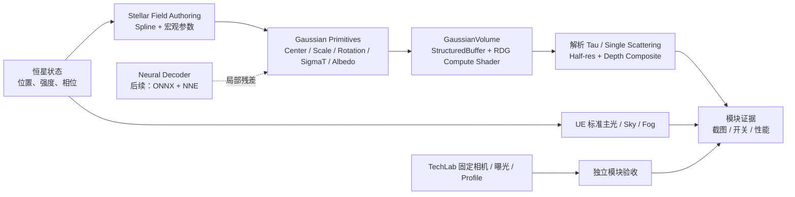

# Bifrost Technical Map

> 2026-07-10 共同收敛版。本文件定义 Bifrost 当前保留的技术系统；未列入“当前系统”的内容不进入实现或排期。

## 1. 最终形态

Bifrost 的最终展示形态是固定镜头优先的实时场景，不是第三人称可玩关卡。**当前阶段不做场景**：先在独立 TechLab 逐项把技术做成可运行、可控、可测量的模块，完整标准见 `TECH-VALIDATION.md`。核心候选成果仍是由恒星驱动的 **Gaussian Field**：曲线和宏观参数定义体积流带，UE Compute Shader 用解析 Gaussian 光学深度进行实时渲染；后续再以轻量神经 decoder 生成局部时变。

## 2. 当前系统

| 层级 | 保留技术 | 负责什么 | 当前完成度 |
|---|---|---|---|
| 测试底座 | `L_Bifrost_TechLab`、固定相机、统一曝光、profile 模板 | 保证模块可独立比较和复现 | 待创建 |
| 环境底座 | Kitbash 静态网格、Lordenfel 适配、`M_Env_Uber`、基础海面 | 提供可读的海岸遗迹，不承担核心技术叙事 | 部分可用，待 LookDev |
| 恒星控制 | 恒星 Actor、`M_Star_PlasmaCore` Layer 1、标准 Directional Light / Sky Atmosphere / Volumetric Fog | 提供唯一因果源和基础光照 | 材质骨架已存在，未实景验收 |
| Gaussian Field 创作 | `Spline -> anisotropic Gaussian primitives`、厚度/密度/断裂/发光/LOD 宏观参数 | 让体积现象可艺术控制 | 待实现 |
| GaussianVolume Renderer | `StructuredBuffer`、RDG Compute Shader、解析 tau、single scattering、composite | 渲染连续稀疏体积场 | 插件代码已存在，先做运行时验收 |
| 神经层 | 小型 ONNX decoder，经 UE NNE 输出 Gaussian 局部残差/关键帧过渡 | 压缩并生成可控的动态 field；不替代解析 renderer | 后续阶段 |
| 证据层 | 固定机位、开关对比、GPU profile、参数/节点可视化 | 证明系统不是概念或滤镜 | 待建立 |

## 3. 核心成果的边界

### 3.1 Gaussian Field 不是泛用云系统

- 第一应用是 TechLab 中稀疏、方向性、受恒星参数影响的体积流带。
- 画面语义是恒星风 / 日冕帷幕，不是覆盖整片天空的云或独立极光。
- 初版限定一至三条 spline、`32-128` 个 Gaussian；未证明收益前不做通用 VDB 转换、云 LOD 或大规模 primitive 加速。

### 3.2 神经层不是滤镜

- 基线版本先由 spline 和程序参数完整成立。
- 只有当网络能把一组人工认可的 field 关键帧压缩为少量 latent / 控制参数，并产出比普通噪声更连续、更可控的变化时，才接入。
- 网络输出的是 Gaussian 的偏移、尺度、密度和发光残差；解析体积积分仍由 GaussianVolume renderer 完成。
- 训练与推理范围以 8GB 显存可承载的小模型为上限。

### 3.3 环境是承载层，不是第二技术主线

- 海面只需先在主镜头成立；FluidFlux 的 Height RT、岸线交互和 Niagara 无限网格不作为当前 gate。
- Nanite、Lumen、Sky Atmosphere、Volumetric Fog、后处理是 UE 基础能力，不单独包装为项目亮点。
- Lordenfel、Kitbash、`M_Env_Uber` 是生产与 LookDev 工具，不与 Gaussian Field 竞争核心身份。

## 4. 延后模块与历史技术

下列模块都进入独立 TechLab 验收，但不与 Gaussian Field renderer 混成同一个实现任务。每项都必须写清与恒星/Gaussian Field 的关系、性能预算和独立验收。

| 模块 | 可恢复的正确定位 | 重开前提 |
|---|---|---|
| 自定义 Raymarch | 局部云层、极光或天空介质的补充 renderer；不替代 Gaussian Field | 独立完成 T5 |
| HPVolumeCloud | 提炼其云体积、光照和参数组织思路，并在 UE 中重实现/适配；不是直接复制 Unity HDRP 代码 | 在 T5 基础上完成 T6 |
| 恒星 Layer 2 Marching Cubes | 恒星轮廓/日珥的局部 isosurface 强化 | 独立完成 T7；先验证噪声场到 SDF 的转换和 GPU 预算 |

以下内容目前不构成 Bifrost 技术目标，保留为历史候选或资产：

| 项目 | 处理 |
|---|---|
| 第三人称角色、PlayerStart、完整 S1-S4 跑图 | 不再作为项目目标或验收；保留现有资产，不继续投入 |
| 铁磁流体海刺 | 回到历史技术候选，不启用 |
| 泛用 VDB 转 Gaussian 生产管线、云 LOD 代理 | GaussianVolume 的独立研究支线，不作为 Bifrost 交付 |
| 泛用 3DGS 场景扫描 / splat 导入 | 不启用 |
| Landscape、PCG、Foliage 量产 | 不启用 |

## 5. 技术门禁

| Gate | 完成条件 |
|---|---|
| T0 TechLab | 独立测试关卡、固定相机、统一曝光、开关与 profile 模板可用 |
| T2 Renderer | GaussianVolume Actor 在 UE5.8 正确渲染、随相机稳定、光照/合成正确 |
| T3 Field | spline 生成的 `32-128` primitive 可控；有 half-res、遮挡和 GPU 数据 |
| T4 Neural | ONNX 小模型通过 NNE 在 UE 中驱动 field 残差；有与程序动画的对比和性能数据 |

技术模块的完整验收与依赖以 `TECH-VALIDATION.md` 为准。场景集成在这些模块验收后才重开。
