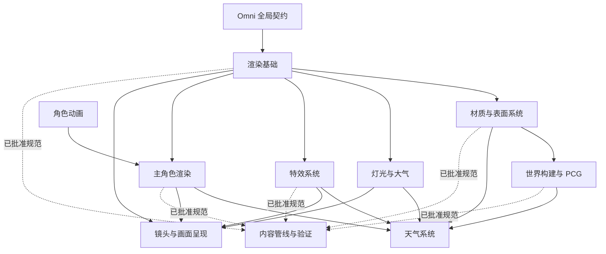

# Omni · TA 系统总图

## 目的

本文是项目级技术美术系统的权威总图，覆盖生成和控制 3D 画面与角色动作的主要系统。
它回答四个问题：

1. 一条需求由哪个模块主责？
2. 哪些模块为它提供数据，哪些模块消费它的数据？
3. 该模块明确不负责什么？
4. 何时值得为该模块建立具体实现项目？

总图只定义职责和路由。具体架构、资产规范、实现、预算、测试和证据均属于被路由的
具体项目。

## Omni 负责的全局契约

以下内容保留在 Omni 中，约束所有具体项目，不单独作为实现项目：

| 全局契约 | 负责内容 |
|---|---|
| 视觉基线 | 美术方向、参考视图、对比条件，以及负责人批准的质量标准 |
| 交付目标 | 目标平台、镜头假设、支持的场景规模和交付限制 |
| 帧预算 | 项目级帧时间、GPU、CPU、内存、流送和加载预算 |
| 画质档位 | 档位名称、目标硬件、功能降级和跨模块可扩展策略 |
| 路由登记 | 模块负责人、权威项目与规范链接、当前 Gate、提供方和消费方 |

性能、可扩展性、调试和验证是每个模块必备的验收维度。只有重复且已验证的工作真正
产生共享工具需求时，它们才可能成为独立项目。

## 顶层模块

### 1. 渲染基础

**负责**

- 渲染路径和受支持功能的技术基线。
- 全局色彩空间、HDR/SDR、Tone Mapping、抗锯齿、升采样和渲染器画质策略。
- 项目级 GI、阴影、反射、半透明和渲染调试视图规则。

**不负责**

- 场景灯光制作、内容材质、镜头行为或单个视觉特效。

**主要依赖**：Omni 全局契约。

**候选项目名**：`RenderFoundation`。

### 2. 材质与表面系统

**负责**

- Master Material 家族、共享 Material Function、着色配方和实例化策略。
- 纹理打包、通道语义、分辨率、Virtual Texture、Decal 和表面数据规范。
- 湿润、积雪、污损、受伤、风力和交互遮罩等通用表面响应接口。

**不负责**

- 天气何时变化、特效何时生成、资产如何放置，以及主角色的姿势和动画。

**主要依赖**：渲染基础。

**候选项目名**：`MaterialSystem`。

### 3. 灯光与大气

**负责**

- 灯光配置、天空、日月视觉响应、曝光基线、雾、云、GI、阴影和反射等场景系统。
- 灯光画质档位、可安全过渡的参数、诊断视图和灯光预算。

**不负责**

- 世界或玩法时间、天气状态决策、降水特效，以及表面着色实现。

**主要依赖**：渲染基础；材质与表面系统。

**候选项目名**：`LightingAtmosphere`。

### 4. 天气系统

**负责**

- 权威天气状态、状态过渡、混合、持久化和对外控制参数。
- 灯光、大气、表面响应、特效、世界资产、主角色响应、音频和玩法消费方之间的协调
  契约。
- 天气画质档位和一致的降级行为。

**不负责**

- 重复实现灯光、材质、Niagara 特效、角色着色、音频或玩法逻辑。各消费方负责实现
  自己对天气契约的响应。

**主要依赖**：灯光与大气；材质与表面系统；世界构建与 PCG；特效系统；主角色渲染。

**候选项目名**：`WeatherSystem`。

### 5. 世界构建与 PCG

**负责**

- Landscape、生态区、植被、Spline、散布、放置和程序化生成规则。
- PCG Graph 规范、数据结构、确定性再生成、美术手动覆盖和生成资产的归属规则。
- World Partition、Data Layer、流送单元、HLOD 集成和大世界视觉预算。

**不负责**

- 源资产 LookDev、全局材质架构、天气状态或通用特效制作。

**主要依赖**：渲染基础；材质与表面系统。

**候选项目名**：`WorldPCG`。

### 6. 特效系统

**负责**

- Niagara System、Emitter、Module、参数和命名规范。
- 特效贴图、Mesh、材质、Ribbon、Decal、模拟、挂接和事件接口规则。
- 特效分类、复用策略、LOD、Significance、确有必要时的对象池、预算、性能分析和
  调试视图。

**不负责**

- 玩法决策、天气状态、动画状态或共享材质系统。特效系统只消费它们提供的事件和契约。

**主要依赖**：渲染基础；材质与表面系统。

**候选项目名**：`VFXSystem`。

### 7. 主角色渲染

**负责**

- 主角色 Mesh、拓扑约束、LOD、皮肤、眼睛、头发、Groom 或 Cards、服装和角色专用
  着色。
- Morph/Deformer 渲染、材质层响应、受伤/污损/湿润集成、阴影表现、灯光兼容性和
  主角色渲染预算。
- 对动画曲线、Socket、姿势输出、天气状态和特效挂点的视觉消费。

**不负责**

- 玩法动作规则、权威世界位移、姿势选择、Locomotion 逻辑或通用材质基础。

**主要依赖**：渲染基础；材质与表面系统；灯光与大气。

**候选项目名**：初期使用 `HeroCharacter`。在渲染和动画出现独立交付 Gate 或独立生命周期
之前，两者作为同一项目内的两条工作线。

### 8. 角色动画

**负责**

- Skeleton、Rig、Retarget、动画来源、压缩、Curve、Notify 和 Root Motion 规范。
- Locomotion、State Machine、Montage、确有需要时的 Motion Matching、IK、Control Rig、
  Motion Warping、面部动画、次级运动、物理动画，以及动画 LOD 和预算。
- 与玩法移动和主角色渲染之间有关姿势、曲线、Socket 和时序的接口契约。

**不负责**

- Gameplay Ability 规则、权威世界位移、角色着色或最终特效渲染。

**主要依赖**：主角色 Skeleton 和玩法移动契约；其姿势输出由主角色渲染消费。

**候选项目名**：初期使用 `HeroCharacter`；只有出现独立 Gate 时才拆分为
`CharacterAnimation`。

### 9. 镜头与画面呈现

**负责**

- 游戏与过场镜头行为、构图、镜头参数、Camera Shake 和过渡规则。
- 镜头局部曝光或后处理覆盖、景深、运动模糊、调色、屏幕空间表现特效和 Sequencer
  集成。
- 与镜头有关的质量假设和最终画面审阅条件。

**不负责**

- 玩法规则、全局渲染器实现、环境灯光、角色动画或世界内容。

**主要依赖**：渲染基础；灯光与大气；特效系统；主角色。

**候选项目名**：`CameraPresentation`。

### 10. 内容管线与验证

**负责**

- 当工作流确实需要共享时，负责 DCC 导入导出契约、命名、目录、Metadata、资产验证、
  批处理和公共证据采集。
- 把已经批准的领域规则转化为可重复执行的自动检查。

**不负责**

- 领域内的视觉决策或规范。每个领域项目先负责建立并验证自己的规则和最小验证器。

**主要依赖**：所有已路由领域项目中已经批准的规范。

**候选项目名**：`ContentPipeline`。只有至少一个跨项目工作流已经拥有手工基线和可量化
收益时才建立。

## 依赖主干



箭头从被依赖模块指向声明该依赖的模块，不代表运行时数据方向，也不代表项目排期顺序。

## 跨模块接口规则

1. 提供方项目拥有共享接口的数据结构、语义、默认值和版本。
2. 消费方项目只拥有自己的适配和视觉响应。
3. Omni 只记录负责人、依赖、当前 Gate 和权威链接，不复制接口规范。
4. 修改共享契约时，在同一次切换中更新所有活跃的提供方、消费方、验证器和文档，不保留
   兼容层。
5. 动画输出姿势、曲线、Socket 和时序；主角色渲染负责它们的视觉响应。
6. 天气输出状态和过渡；灯光、材质、特效、世界、角色、音频和玩法消费方分别负责自己的
   响应。
7. 特效消费玩法、动画、环境和天气事件，但不成为这些事件的权威来源。

## 条件模块

在真实项目证明其拥有独立 Gate 之前，以下能力保留在最接近的现有负责模块中：

- 水体与水下渲染。
- 破坏、流体和大规模物理模拟。
- 群体渲染和群体动画。
- 自定义渲染、NPR 或引擎源码渲染器修改。
- 仅用于过场的角色与面部管线。
- 超出首个领域最小验证器范围的共享 TA 自动化。

## 项目路由 Gate

只有同时满足以下条件，顶层模块才转化为具体项目：

- 已经存在真实场景、角色、特效或生产消费方。
- 问题和最小可通过的视觉或技术结果已经明确。
- 模块拥有独立负责人、独立职责和独立验收 Gate。
- 实现或证据会持续存在，而不是只服务于 Omni 的一条待办。
- 可以明确说出提供方和消费方契约，并且没有复制其他模块的职责。

如果需要实时 Unreal 工作，通过以下命令创建项目：

```text
/project-init <ProjectName> --ue
```

具体项目从三件套开始，只有实现决策确实需要时才增加一个 `SPEC.md`。不要预先创建上文的
候选项目。
