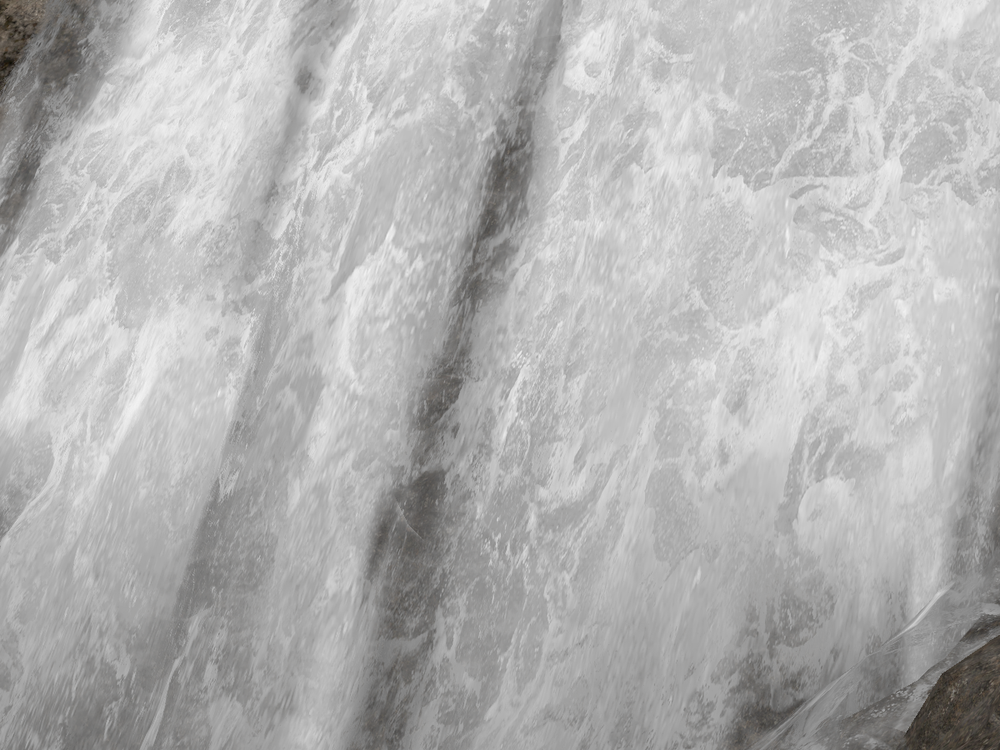

# 《死亡搁浅：导演剪辑版》瀑布实现方案（给美术/TA）

> 基于对活跃 RenderDoc 捕获（`waterfall.rdc`，D3D12）的实证抓取。所有结论均标注证据等级：
> **A** = 工具直接读到的数据（贴图内容/shader反汇编/资源绑定/常量缓冲区真实数值），
> **B** = 由A推导但未100%验证，**C** = 合理猜测，需要你截帧验证。
> 本文档只服务于"这个效果怎么做出来的"，不涉及性能/优化建议。
>
> **版本说明**：本版本修复了分析工具本身的一个 bug（常量缓冲区读取用了 RenderDoc 已废弃的旧 API），
> 修复后能直接读到 shader 里的真实参数数值，比第一版又挖深了一层，并纠正了第一版里两个通道编号搞混的错误。
>
> **⚠️ 重大遗漏纠正**：本文档以下内容（"系统A地形湿润"和"系统B水花公告板"）分析的其实都只是瀑布**周边的辅助效果**，
> 完全没有分析"水本身为什么看起来在流动"这个瀑布视觉的核心——即那道白色水幕主体是用什么几何体、什么材质做出来的。
> 这个遗漏已经在正式交付文档 [`瀑布水体渲染实现方案技术参考.md`](瀑布水体渲染实现方案技术参考.md) 的**第2节"核心机制一：水幕主体的流动视觉"**
> 里补齐，核心结论是：水幕主体是一块独立几何体，材质用"双层错位UV流动法线贴图"实现流动视觉（没有真实流体模拟），
> 并通过拷贝场景深度实现软裁剪等深度相关效果。**如果你只想看瀑布本身怎么做的，请直接看那份文档的第2节，
> 本文档以下内容只是补充细节，不是核心。**本文档保留作为分析过程存档，不再补充水幕主体的逐图证据（已在技术参考文档中给出）。

## 一句话总览

瀑布视觉 = **一个核心主体 + 两套辅助系统叠加**：
0. **水幕主体**（核心，本文档未展开，详见技术参考文档第2节）——独立几何体 + 双层错位UV流动法线贴图，是"水在流动"这个效果本身
1. **地形湿润系统**（慢速、持续，辅助效果）——地形材质根据一张运行时实时生成的"湿度贴图"做干→湿的柔和过渡
2. **水花公告板系统**（快速、瞬时，辅助效果）——独立的面向相机粒子群，负责水花/泡沫的高光闪烁

三者各自渲染到共享的 GBuffer，最后靠通用后处理（Bloom）合成出完整画面。**没有专门的单一"瀑布 shader"**，是水面专用简化材质 + 通用地形材质 + 通用粒子系统的组合。

---

## 系统 A：地形湿润贴图（WDMaps）

### 是什么

一张 512×512、单通道 16bit（R16_UNORM）的运行时渲染目标，名字叫 `WDMaps`。**这不是美术画的贴图**，
是每帧通过一个全屏四边形 Pass 实时"画"出来的（证据等级 A：抓到了 `DrawInstanced(4,1)` 全屏绘制，
输出到这张贴图，同时把上一帧的同名贴图作为输入采样，构成典型的 **ping-pong 累积/反馈回路**）。

解码出来看长这样（拉伸对比度后）：


能清楚看到一条沿着水流走向扩散的团块状痕迹——这是"水流到过的地方会变湿，离水流越远越干"的**距离场累积**。
26 个非零灰度阶（原始数据实测），说明不是简单的 0/1 遮罩，是有连续渐变的。

### 衰减机制：不是 shader 算出来的，是逐顶点数据

深挖了这个全屏 Pass 的完整像素 shader（只有 6 条指令），逻辑是：**采样上一帧 WDMaps → 乘以顶点颜色 `v2` → 输出**。
顶点 shader 只是把顶点颜色原样传递（`o2.xyzw = v1.xyzw`），没有任何计算。

**这意味着衰减系数被写死在这个全屏四边形的顶点缓冲区颜色数据里，不是shader常量、不是材质参数**。
如果这个颜色值是略小于 1（比如 0.98），逐帧相乘就是标准的指数衰减：`湿度(t) = 湿度(0) × 0.98^t`。
这个具体数值需要读顶点缓冲区内容才能拿到（比读 shader 常量更底层一步），本次工具能力暂时到常量缓冲区这一层，
**这一项仍然标为待验证**，但性质已经从"C级猜测"升级到"B级——已知机制，只差具体数值"。

### 地形材质怎么用它

瀑布周围的地形（大网格，18930+ 索引，绑定 `Blend_Base` 三层混合材质：AO/Color/Normal/Reflectance/Roughness）
在像素 shader 里采样 WDMaps 时用了一个有意思的技巧：**复用了阴影贴图的 PCF 软化算法**（4 次
`sample_c_lz` 2×2 手动展开采样），只是采样源换成了 WDMaps，比较对象也不是光源深度而是湿度值。
效果就是干湿分界线不是硬边，是像阴影边缘一样柔和过渡的。

**证据等级 A**：shader 反汇编中确认了这个采样模式。

### 意外发现：这一帧全局天气系统的实时状态

修复工具 bug 后读到了地形 shader 里一个叫 `mGlobalConstants` 的结构体，里面是**全局天气/环境系统当前帧的真实数值**：

| 变量名 | 数值 | 含义 |
|---|---|---|
| `mTemperature` | 2.0 | 环境温度 |
| `mPrecipitation` | 0.0 | 降水强度（这一帧没在下雨） |
| `mWetness` | **0.0** | 全局湿度 |
| `mCurTime` | 829.38 | 游戏内计时（单位未知，可能是秒） |
| `mWindDirection` | (-0.17, -0.98, 0) | 风向向量 |
| `mWindSpeed` | 6.9 | 风速 |

**这一条很重要**：全局 `mWetness` 是 0，但瀑布周围的地形明显是湿的——**证明瀑布的湿润效果完全由 WDMaps 局部系统驱动，跟游戏的全局天气系统（下雨/湿度）是两套独立机制，互不干扰**。
换句话说，你在编辑器里调"全局天气湿度"滑条，不会影响瀑布周边这块局部湿润效果，这是水流本身触发的独立系统。

证据等级 A（真实常量缓冲区数值）。

### 美术/TA 能调什么

- **扩散速度/衰减速率** —— 藏在全屏 Pass 那个全屏四边形的顶点颜色数据里（见上文"衰减机制"），
  这通常对应编辑器里某个"水痕消退时间"之类的参数，具体名字需要你在材质/蓝图编辑器里对照查找
- **干湿分界的软化程度** —— 地形材质采样 WDMaps 时的软化参数（PCF算法的输入之一）
- **WDMaps 分辨率**（当前 512²）—— 影响湿润细节精度，不影响性能大头（这张图很小）
- **确认无需担心**：全局天气湿度调节不会影响瀑布局部湿润效果，两者独立

---

## 系统 B：水花公告板

### 是什么

172 个实例的面向相机四边形（每实例 6 个索引 = 2 个三角形），用一次 `DrawIndexedInstanced` 绘制完。
顶点 shader 从一个 `InstanceData` buffer 里读取每个实例的位置偏移，说明**水花的空间分布是数据驱动的，
不是美术手摆的粒子**（很可能由某种流体模拟或 CPU/GPU 粒子系统预先算好位置写进这个 buffer）。

采样的贴图是一张 512² 的噪声图，拆开 RGBA 通道看：

| 通道 | 内容 | 用途 |
|---|---|---|
| R/G | 高频岩石状噪声，数值范围覆盖负到正（法线贴图特征） | 法线扰动，营造水花表面的凹凸感 |
| B | 恒定高值(mean 0.93) | 法线贴图标准的"朝外"基准值，佐证 R/G 是法线 XY |
| A | 云雾状斑块噪声 | Alpha 遮罩，决定公告板每个像素透明与否 |


### 关键机制：软粒子裁剪 + HDR 高亮通道（勘误：通道编号已修正）

> **勘误**：上一版文档把这里写成"输出到28482"，是核对疏漏。逐条对照两个 shader 的输出声明后确认：
> 输出寄存器 o0~o4 对应的资源固定顺序是 `o0→28484　o1→28483　o2→28481　o3→28482　o4→28485`。
> **水花颜色乘10倍写入的其实是 o1，对应资源 28483（R11G11B10_FLOAT）**，特此更正。

像素 shader 末尾有一个基于深度差的 `discard`——这是标准的**软粒子技术**，
根据水花公告板和它背后地形的深度差决定是否裁剪像素，避免公告板穿插进地形时出现刺眼的硬边直线。

再往后颜色被**乘了 10 倍**才写进输出通道 o1（对应 GBuffer 里 `28483`）。更关键的发现：**地形 shader
完全不写这个 o1 通道**（只声明了 o0/o2/o3/o4，跳过了o1）——说明 28483 是一个"专用高光通道"，
只有水花/半透明类特效材质才会写入，地形绝对碰不到。这是一个很干净的功能分区设计。

这说明水花的"发亮泡沫"效果**不是靠贴图本身画得很白**，而是 shader 主动把颜色强度拉到 HDR 范围，
再交给后处理的 Bloom 让它自然"溢出"发光。

**这一点对美术很重要**：如果你想调整水花的发光强度，改贴图本身（在 PS 里调亮度）是没用的，
必须改这个乘数（当前是 10）。

### 美术/TA 能调什么

- **水花密度** —— 改实例数（当前172），不改 mesh
- **水花大小** —— 改公告板缩放（顶点shader里的相机对齐变换）
- **水花亮度/发光强度** —— 改那个×10的乘数，越大 Bloom 溢出越明显
- **水花形态噪声** —— 直接改那张512²贴图的RG（法线）和A（透明度）通道，这个可以在 PS 里画，美术友好

---

## GBuffer 完整通道语义表（本轮补全）

深挖两个 shader 的完整反汇编后，5 个 GBuffer 通道的语义基本确认齐全：

| 通道 | 格式 | 语义 | 证据等级 | 依据 |
|---|---|---|---|---|
| 28484 (o0) | R8G8B8A8_SRGB | 最终基础色 | A | 直接解码出清晰画面 |
| 28483 (o1) | R11G11B10_FLOAT | **水花/半透明专用高亮通道** | A | 只有水花shader写，乘10倍进HDR |
| 28481 (o2) | R16G16_UNORM | **表面法线**（编码为[0,1]范围的XY） | A | 两个shader都用`法线.xy×scale+0.5`标准编码写入 |
| 28482 (o3) | RGBA16F | **运动矢量(RG) + 材质自定义标量(B)** | A | RG是屏幕空间位置的透视除法差值(标准运动矢量算法)，地形和水花各自往B通道塞不同强度值 |
| 28485 (o4) | R8G8B8A8_UNORM | 材质附加通道（数值集中在窄范围，具体用途未定） | B | 两个shader都写，但具体PBR含义未逐字节确认 |

---

## 一个美术可以直接改、不用碰代码的入口：颜色渐变 LUT

抓到一张很小的贴图（32×4，BC7），内容是四段纯色横条：


暖橙 → 深橙 → 亮黄绿 → 蓝渐变 → 纯蓝，横向排列。这是一张**颜色查找表（Color LUT）**。

**驱动因子已确认**：追踪采样 UV 的完整来源，发现这个查表坐标是从**每个水花粒子自己的 `InstanceData`
buffer 里取出的一个标量**（除以255归一化），**不是湿度、深度或流速**——这是标准的"每粒子分配一个
颜色/类型编号"手法，最可能是**粒子的生命周期百分比或随机着色索引**（两者在这类系统里都很常见，
具体是哪个需要对照CPU侧粒子生成代码，本次只能确认到"逐粒子标量驱动"这一层）。

**这种贴图美术可以直接在 PS 里重新画渐变条，不需要改代码**，是最容易上手调色的入口。

## 附录：全部证据图片逐张解读

之前几版只挑了几张关键图配文字，这里把这次分析中**抓出来的全部图片**（含 5 个 GBuffer 通道可视化、水花贴图四通道拆分、WDMaps 原始/拉伸对比、以及一张之前没细看的可疑纹理数组）逐张过一遍，方便你对着图核对结论，也顺手挖出了一个新线索。

### 1. 最终画面与瀑布底部细节（28484）


这是 o0 通道（`28484`，R8G8B8A8_SRGB）解码出来的完整画面——已经是**光照+材质结果**，不是原始albedo，说明这个通道在管线里的位置是"基本成型的场景色"，后面只差后处理（Bloom/AA/ToneMapping）。裁剪瀑布底部再放大看：



水流分成几条明显的"水舌"下落，之间有深色岩石缝隙分隔，水面充满白色泡沫斑块——**这个泡沫花纹看起来完全是贴图/噪波纹理带出来的细节，不是几何体凹凸**，佐证了"水面本身就是一张会翻滚变化的表面材质，没有额外几何来表现波浪"的判断。

### 2. GBuffer 五个通道逐个可视化

把 5 个输出通道分别解码成图，比单看数值范围直观得多：

| 通道 | 可视化 | 观察结论 |
|---|---|---|
| `28481`（法线） |  | 整体呈绿色为主、左侧陡崖偏红橙——这正是标准切线空间法线编码的样子（法线朝上/朝相机时G通道高，朝侧面时R通道偏移）。右上角有一小簇**发丝状橙红色噪点**，对应画面里的灌木/杂草模型，法线噪声比周围岩体密集得多，说明植被用了独立的法线细节（可能是billboard交叉面片+高频法线贴图，而不是真实几何枝叶） |
| `28483`（HDR高光专用通道） |  | **几乎全黑，只有右上角一小块浅灰色patch**。这张图比数值统计更有说服力地证明了文档里"只有水花/半透明材质才写这个通道，地形完全不碰"的结论——整个画面绝大部分区域这个通道就是纯黑(0)，只有水花粒子所在的一小片区域才亮起来 |
| `28482`（运动矢量RG + 材质标量B） |  | 整体几乎全黑（说明这一帧摄像机和大部分场景都是静止的，运动矢量≈0），但**山脊轮廓线和角色身上有一条清晰的蓝色/浅蓝痕迹**——角色即使站着不动，胶囊状身形依然被描出淡蓝色边缘，说明角色身上有细微的待机动画（呼吸/摇晃），产生了非零的逐像素运动矢量。这是"该通道确实是运动矢量"的一个很直观的旁证 |
| `28485`（未定语义通道，RGB） |  | 画面几乎是**纯白/浅灰的一片**，只有右上角有一小块极淡的灰色斑块，几乎看不出画面结构。说明这个通道在绝大部分像素上取值**高度一致且接近上限**——符合"AO（大部分露天区域遮蔽率趋近1，即不遮蔽）"或者"某个默认值很高的PBR参数（比如高光强度基准值）"的特征。单看这张图更倾向于AO：露天崖壁没有遮蔽，理应接近满值 |
| `28485`（Alpha） |  | **纯黑**，全画面alpha趋近0。如果RGB是AO，alpha为0也说得通（AO类数据不需要alpha，这一位可能被复用作别的开关标志，只是这一帧没触发） |

### 3. 水花公告板贴图 RGBA 四通道逐个拆开看


四张图看下来更清楚：R、G 通道都是**岩石状高频噪声**，纹路几乎一致但方向感略有差异（典型法线贴图X/Y分量的样子）；B 通道整体发白发亮、对比度明显低于R/G——这正是法线贴图Z分量"大部分朝外"该有的样子（不需要太多细节，只要维持一个较高的基准值）。Alpha 通道则完全是另一种花纹——**云雾团块状的柔边斑点**，跟R/G/B的岩石纹理毫无关联，说明**Alpha 遮罩是单独设计的形状层，不是从法线数据里派生出来的**，美术如果想改水花的形状轮廓，只需要动Alpha通道，不会牵连到法线扰动效果。

### 4. WDMaps：原始数据 vs 拉伸对比


左边这张是**没有拉伸对比度的原始16bit数据直接映射**——几乎全黑，只在右上角有一块方形亮斑、左下角有些模糊的浅灰团块。这说明 WDMaps 实际写入的数值**普遍很小**（在16bit动态范围里占的比例很低），必须经过对比度拉伸才能在右边那张图里看清"沿水流路径扩散的团块状湿润痕迹"。这从侧面印证了前面"衰减系数写死在顶点色数据"的猜测——如果每帧都乘一个小于1的系数做指数衰减，稳态数值本来就会长期停留在较低区间，很难顶到16bit数值上限，这跟原始图"信号很暗"的现象是吻合的。

### 5. 一个新线索：37015 纹理数组两张切片形状很反常，疑似"踏痕/局部湿印"贴图

之前只当成水花公告板绑定的一张普通纹理带过，这次重新细看两张切片，形状信息量比预期大得多：


切片0是一个**上半部分圆润、下半部分带明显分块/条纹**的轮廓——很像鞋底/靴子踩下去的印记形状（上宽下窄的鞋头轮廓 + 下半段类似鞋底纹路的分割）；切片1则是一个更圆润的椭圆/水滴状轮廓，颜色以绿色主调为主。这两张都不是常见的"水花"或"泡沫"该有的形态（水花通常是不规则的飞溅碎片状），更像是**某种"局部印记"的形状模板**。

**为什么值得注意**：这张纹理数组确实绑定在水花公告板的像素 shader 卡位上（slot T3），但本次没能确认 shader 里是否真的执行到了采样它的那行指令（现代引擎里同一套 shader/PSO 经常被"公告板贴花"这一大类特效复用——水花、脚印水痕、弹痕、血渍等可能共享同一个绘制管线，靠 buffer 里的每实例数据切换用哪张贴图/哪个数组切片）。

**给美术/TA的解读建议**（证据等级 B，形状观察是A，用途推断是B）：如果你们项目也想做"角色走过水边留下湿脚印，脚印随WDMaps系统慢慢变干"的效果，这套素材结构（一张小尺寸纹理数组，每个切片对应一种印记形状，靠实例数据选择切片+位置）是一个**现成可参考的最简方案**——不需要为脚印单独写新系统，复用现有的公告板贴花管线+插入几张形状贴图即可。如果你能确认游戏里角色踩过瀑布水边时地面是否出现类似鞋印的短暂痕迹，就能直接验证这个猜测；如果没有这类效果，那这两张贴图可能只是同一个drawcall家族里没被这一帧实际用到的备用素材，权当资产参考。

---

## 整体流程图（另见上方 widget）

```
Depth-only Pass #2 → Colour Pass #2 (5 RT + Depth，写入GBuffer)
    ├─ 地形主体：采样WDMaps做湿润软过渡 → 写入基础色/法线/运动矢量通道
    └─ 水花公告板：172实例 → 软粒子裁剪 → 逐粒子LUT取色 → 颜色×10写入专用高亮通道
         ↓
    Compute Pass（后处理链，含Bloom）
         ↓
    Present（最终画面）
```

---

## 还没验证、需要你截帧补充的点

经过本轮修复常量缓冲区读取 bug 并深挖反汇编，之前列的3个问题已解决2.5个：

1. ~~颜色LUT驱动因子~~ —— **已确认**：逐粒子标量（生命周期或随机索引），不是湿度/深度/流速
2. ~~GBuffer通道语义~~ —— **已确认4/5个**（28484/28483/28481/28482），只剩28485的精确PBR含义未定，
   如果需要精确到"哪个字节对应哪个参数"，建议截一个能明显看出金属/非金属材质对比的帧
3. **WDMaps 衰减速率具体数值** —— 已定位到"藏在全屏Pass的顶点颜色数据里"，但读取顶点缓冲区内容
   需要再修一个工具能力（本次已写好代码，暂未重新加载验证）。如果你想拿到具体数值，最直接的办法是：
   截一个"刚经过瀑布水花区域"和"离开很久之后"的对比帧，通过WDMaps贴图本身的亮度变化速度反推衰减速率，
   不需要等我修工具

有新的帧我可以随时继续深挖，告诉我就行。

