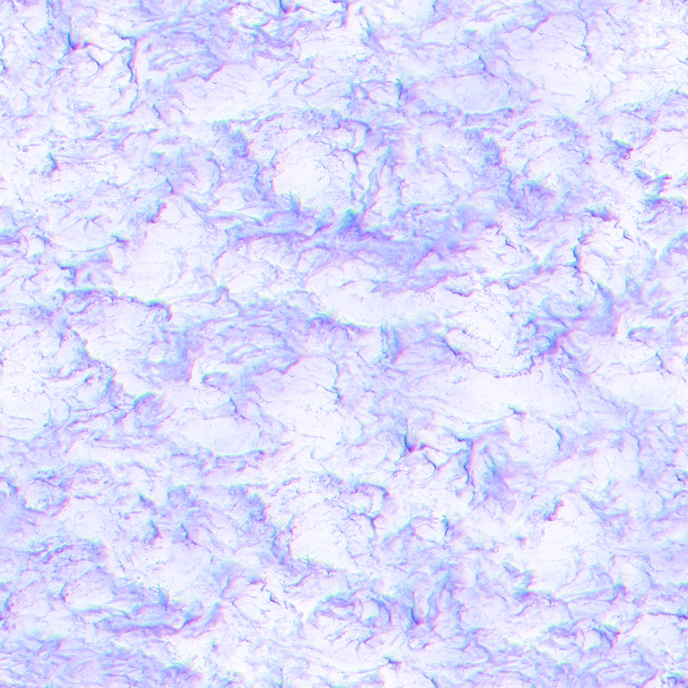
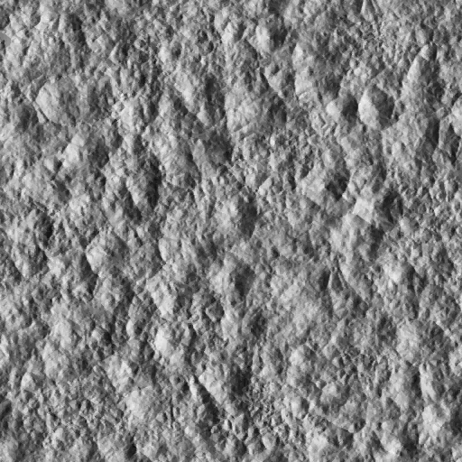
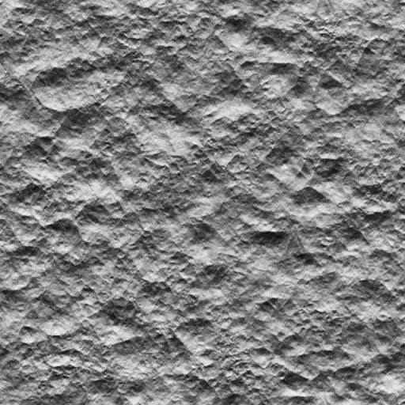
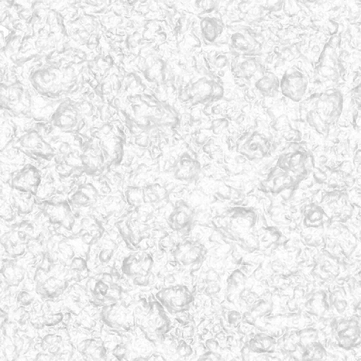
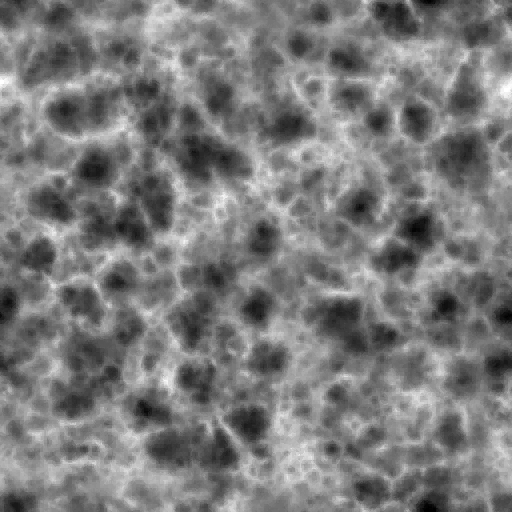

# 瀑布水体做法


---

## 1. 大水幕

### Mesh

用的是**顺着山壁和水流路线拉出来的高密度曲面网格**；这一帧提交了 3 段水幕 Mesh，其中真正画到屏幕上的是事件 9135。

| 水幕段 | 网格规模 | 这帧的情况 |
|---|---:|---|
| Draw 9135 | 18,471 索引，最多 6,157 个三角形 | 真正可见的主瀑布 |
| Draw 9143 | 62,898 索引，最多 20,966 个三角形 | 这帧没有画出像素 |
| Draw 9150 | 35,388 索引，最多 11,796 个三角形 | 和 9143 是同一大网格的下一段，这帧没画出像素 |


9135

![[Pasted image 20260717184954.png]]

9143
![[Pasted image 20260717190431.png]]


9150
![[Pasted image 20260717190456.png]]
**先把瀑布的大轮廓、水舌分叉和贴山走势做进 Mesh，材质只负责让它动起来。**

### 着色模型

它走的是**延迟渲染 GBuffer 的Mask水材质**：会写基础色、法线、运动矢量和深度，不是普通透明材质；边缘靠深度遮罩和 `discard` 裁掉。
### 材质效果

**同一张流动法线采两次，让两层 UV 错开半个周期往下滚，再混合起来，最后结合场景深度把不该出现的水裁掉。**

```hlsl
// 水幕 VS：Mesh 本身已经建好，VS 只负责放到场景里，并输出法线、UV 和运动矢量数据。
worldPos = TransformWaterMesh(vertex.position, instanceTransform);
output   = BuildWaterVertexOutput(worldPos, vertex.normal, vertex.tangent, vertex.uv);
```

```hlsl
// 水幕 PS：一张法线图错位采两遍，看起来就像水一直往下流。
phase   = frac(Time * FlowSpeed * 0.1);
normalA = FlowNormal.Sample(uv + FlowOffset(phase));
normalB = FlowNormal.Sample(uv + FlowOffset(frac(phase + 0.5)));
normal  = Blend(normalA, normalB);

// 读画面里已经有的深度，把水和山体相交处、无效边缘裁掉。
sceneDepth = SceneDepthCopy.Load(pixelPosition);
mask = BuildWaterMask(sceneDepth, waterDepth, uv);
clip(mask - Cutoff);

WriteGBuffer(BaseColor, normal, MotionVector, mask);
```

### 贴图

主体水幕其实只用两张主要输入图：

| 贴图 | 干什么用 |
|---|---|
| 场景深度副本 `28490` | 看水幕前后有没有山体，做相交遮罩和裁剪 |
| 流动法线 `6813975` | 提供向下流的白色条纹、沟槽和表面法线细节 |




流动法线 `6813975` 的四个通道：

| R（切线空间法线 X） | G（切线空间法线 Y） | B（切线空间法线 Z） | Alpha（泡沫/白水与覆盖遮罩） |
|---|---|---|---|
|  |  |  |  |

这是一张 `BC7_UNORM` 的 **RGBA 通道打包贴图**。Shader 对两次采样的 RGB 都有显式 unpack：第一层使用 `saturate(rgb) * 3.2 - 1.6`，第二层等价于 `saturate(rgb) * 2.0 - 1.0`，混合后再归一化。它没有使用 BC5 法线常见的 `sqrt(1-x²-y²)` 重建 Z，因此 **B 是直接存储并参与运算的法线 Z**。

**Alpha 才是泡沫/白水通道，同时兼作覆盖遮罩**：第二次采样的 A 经 `pow(A, 0.4)` 控制两层法线的混合权重；两次采样的 A 取最小值后继续控制水幕白色条纹的基础色强度、覆盖率和 `discard`。

![[Pasted image 20260717185754.png]]

**曲面 Mesh + 一张可平铺流动法线 + 双层错位 UV + 深度裁剪。**

---

## 2. 水花粒子

### Mesh

用的是**面向相机的小四边形 Billboard**：每个粒子只有 6 个索引、2 个三角形，然后靠实例数据一次画很多个。

这一帧有三批：172 个、9 个和 7 个实例；真正能在画面上看到变化的是最后一批 7 个实例。


### 着色模型

它也是**写 GBuffer 的遮罩公告板材质**，但多了场景深度软交界和高亮输出，用来避免方片插进地面时出现硬边。

### 材质效果

**从实例 Buffer 读每朵水花的位置和大小，采样形状、法线、噪声和颜色 LUT，用深度做软边，Alpha 太低的地方直接裁掉。**

```hlsl
// 水花 VS：所有粒子共用一张四边形，每个实例从 Buffer 里拿自己的位置、尺寸和方向。
particle = InstanceData[instanceId];
worldPos = ExpandBillboard(sharedQuadVertex, particle);
```

```hlsl
// 水花 PS：形状决定哪里有水花，法线决定质感，噪声打散重复，LUT 决定颜色。
shape  = ShapeTexture.Sample(uv);
normal = SplashNormal.Sample(uv);
detail = DetailNoise.Sample(uv);
color  = ColorLUT.Sample(particle.colorIndex);

softEdge = SoftDepthFade(SceneDepth, particleDepth);
alpha = shape.a * detail * softEdge * particle.opacity;
clip(alpha - Cutoff);

effectHighlight = color * 10.0; // Shader 里有一条高亮放大路径。
WriteSplashGBuffer(color, normal, alpha, effectHighlight);
```


### 贴图

| 贴图/数据 | 干什么用 |
|---|---|
| `InstanceData 300` | 每朵水花的位置、大小、方向和调色数据 |
| `8106075` 512×512 | 水花主体的法线和 Alpha 形状 |
| `37015` 10 层纹理数组 | 不同水花/贴花形状切片 |
| `14785` 8×8 | 很小的噪声或阈值扰动图 |
| `37019` 32×4 | 颜色渐变 LUT |
| `6312307` 128×128 | 附加细节、噪声或形状调制 |
| 场景深度 `28489` | 让水花和地面交界变软 |


水花主贴图的四个通道：

| R（法线 X） | G（法线 Y） | B（法线/细节） | Alpha（形状） |
|---|---|---|---|
|  |  |  |  |


**实例化 Billboard + Alpha/法线贴图 + 深度软粒子 + 小 LUT 调色。**


---


---

## 附录：完整 HLSL 重建

> 以下代码是依据 DXBC 反汇编、Shader Reflection 和资源绑定生成的 HLSL 语义重建版。原始变量名、引擎宏和材质节点无法从字节码恢复；水幕与湿润图还原可信度较高，水花 PS 的动态实例 Buffer/位域寻址不保证逐位等价。所有入口均已通过 FXC Shader Model 5.1 编译检查。

水幕和水花的两个 PS 变体各自复用一份共享实现；入口文件通过宏保留对应事件的常数和纹理绑定差异。

### A.1 水幕公共 VS 191858（事件 9135 / 9143 / 9150）

源文件：`evidence/hlsl/water_vs_191858_common.hlsl`

```hlsl
// Reconstructed from DXBC hash 783d39b1-2edca7bb-68e5b1f9-e2446c61.
// Used by events 9135, 9143 and 9150.

cbuffer Scratch_PerInstance : register(b0, space6)
{
    float4 gPerInstance[4068];
};

struct VSInput
{
    float3 position       : POSITION0;
    float3 normal         : NORMAL0;
    float4 tangent        : TANGENT0;
    float4 packedVertex   : TEXCOORD0;
    float2 uv             : TEXCOORD1;
    uint instanceID       : SV_InstanceID;
};

struct VSOutput
{
    nointerpolation uint instanceID : TEXCOORD0;
    float4 previousClipPosition     : TEXCOORD1;
    float4 packedVertex             : TEXCOORD2;
    float4 position                 : SV_Position;
    float4 tangentWS                : TEXCOORD3;
    float3 normalWS                 : TEXCOORD4;
    float2 uv                       : TEXCOORD5;
};

float4 TransformPosition(float3 p, uint row)
{
    return p.x * gPerInstance[row + 0]
         + p.y * gPerInstance[row + 1]
         + p.z * gPerInstance[row + 2]
         +       gPerInstance[row + 3];
}

float3 TransformDirection(float3 direction, uint row)
{
    // DXBC instructions 1-6 use the xyz portion of rows 4-6.
    return direction.x * gPerInstance[row + 0].xyz
         + direction.y * gPerInstance[row + 1].xyz
         + direction.z * gPerInstance[row + 2].xyz;
}

VSOutput main(VSInput input)
{
    VSOutput output;
    const uint instanceBase = input.instanceID * 36;

    // Current and previous clip positions are both emitted for motion vectors.
    output.position = TransformPosition(input.position, instanceBase + 0);
    output.previousClipPosition = TransformPosition(input.position, instanceBase + 8);

    output.tangentWS.xyz = TransformDirection(input.tangent.xyz, instanceBase + 4);
    output.tangentWS.w = input.tangent.w;
    output.normalWS = TransformDirection(input.normal, instanceBase + 4);

    // The original shader squares xyz and forwards w unchanged.
    output.packedVertex = float4(input.packedVertex.xyz * input.packedVertex.xyz,
                                 input.packedVertex.w);
    output.uv = input.uv;
    output.instanceID = input.instanceID;
    return output;
}
```

### A.2 水幕 PS 共享实现

源文件：`evidence/hlsl/water_ps_reconstructed_common.hlsli`

```hlsl
#ifndef WATER_DEPTH_FADE_SCALE
#error WATER_DEPTH_FADE_SCALE must be defined by the entry file.
#endif

cbuffer Scratch_PerFrame : register(b0, space1)
{
    float4 gPerFrame[23];
};

cbuffer Scratch_PerView : register(b0, space3)
{
    float4 gPerView[38];
};

cbuffer ShaderInstance_PerInstance : register(b0, space8)
{
    float4 gMaterial[510];
};

SamplerState gLinearSampler : register(s136, space0);
Texture2D<float4> gSceneDepthCopy : register(t32, space2);
Texture2D<float4> gFlowNormal : register(t4, space7);

struct PSInput
{
    nointerpolation uint instanceID : TEXCOORD0;
    float4 previousClipPosition     : TEXCOORD1;
    float2 vertexMask               : TEXCOORD2;
    float4 position                 : SV_Position;
    float4 tangentWS                : TEXCOORD3;
    float3 normalWS                 : TEXCOORD4;
    float2 uv                       : TEXCOORD5;
    bool isFrontFace                : SV_IsFrontFace;
};

struct PSOutput
{
    float4 baseColor      : SV_Target0;
    float4 effectHighlight: SV_Target1;
    float4 encodedNormal  : SV_Target2;
    float4 motionAndData  : SV_Target3;
    float4 materialData   : SV_Target4;
};

float3 SafeNormalize(float3 value)
{
    return value * rsqrt(max(dot(value, value), 1.0e-12));
}

float3 DecodeFlowNormalA(float3 encoded)
{
    return saturate(encoded) * 3.2 - 1.6;
}

float3 DecodeFlowNormalB(float3 encoded)
{
    return saturate(encoded) * 2.0 - 1.0;
}

float SafeRange(float value)
{
    return abs(value) < 1.0e-5 ? 1.0e-5 : value;
}

PSOutput main(PSInput input)
{
    PSOutput output;
    const uint materialBase = input.instanceID << 1;
    const float4 material0 = gMaterial[materialBase + 0];
    const float4 material1 = gMaterial[materialBase + 1];

    // Instructions 0-13: rebuild an orthonormal TBN frame.
    const float3 tangent = SafeNormalize(input.tangentWS.xyz);
    const float handedness = input.tangentWS.w > 0.25 ? -1.0 : 1.0;
    const float3 bitangent = SafeNormalize(cross(input.tangentWS.xyz, input.normalWS)) * handedness;
    const float3 geometricNormal = SafeNormalize(input.normalWS);

    // Instructions 15-35: two phase-shifted samples of the same flow-normal map.
    const float2 scaledUV = input.uv * material0.yz;
    const float phase = frac(gPerFrame[14].x * material0.x * 0.1);

    const float2 flowUV0 = float2(scaledUV.x * 2.2,
                                  1.0 - (phase * 4.0 + scaledUV.y * 1.05));
    const float4 flowSample0 = gFlowNormal.Sample(gLinearSampler, flowUV0);
    const float3 flowNormal0 = DecodeFlowNormalA(flowSample0.xyz);

    // DXBC keeps scaledUV.y in r3.w here; this offset does not use texture B.
    const float shiftedPhase = phase + scaledUV.y * 0.35;
    const float2 flowUV1 = float2(scaledUV.x * 1.2, 1.0 - shiftedPhase);
    const float4 flowSample1 = gFlowNormal.Sample(gLinearSampler, flowUV1);
    const float blendWeight = pow(max(flowSample1.a, 1.0e-8), 0.4);
    const float3 flowNormalTS = flowNormal0 * blendWeight + DecodeFlowNormalB(flowSample1.xyz);

    float3 shadingNormal = tangent * flowNormalTS.x
                         + bitangent * flowNormalTS.y
                         + geometricNormal * flowNormalTS.z;
    // The original PS biases back faces more strongly toward PerView[2].xyz.
    shadingNormal += gPerView[2].xyz * (input.isFrontFace ? 0.3 : 1.0);
    shadingNormal = SafeNormalize(shadingNormal);

    const float textureAlpha = min(flowSample0.a, flowSample1.a);

    // Instructions 46-55: read the copied scene depth and reconstruct a signed
    // separation value using the captured view constants.
    const float2 depthPixelF = input.position.xy * gPerView[36].xy + gPerView[36].zw;
    const int2 depthPixel = int2(depthPixelF);
    const float rawSceneDepth = gSceneDepthCopy.Load(int3(depthPixel, 0)).y;
    float2 depthTerms = input.position.y * gPerView[21].zw
                      + input.position.x * gPerView[20].zw;
    depthTerms += rawSceneDepth * gPerView[22].zw + gPerView[23].zw;
    const float signedDepthSeparation = -depthTerms.x / SafeRange(depthTerms.y) - input.position.w;

    // Instructions 56-66: fade by the original mesh normal and by depth.
    float orientation = geometricNormal.y * gPerView[13].z
                      + geometricNormal.x * gPerView[12].z
                      + geometricNormal.z * gPerView[14].z;
    orientation = saturate((orientation - 0.98) * 100.000099);
    const float orientationBias = lerp(-material1.y, 0.0, orientation);

    float depthMask = saturate(abs(signedDepthSeparation) * WATER_DEPTH_FADE_SCALE);
    float farDepthMask = saturate((abs(signedDepthSeparation) - 100.0) * 100000.0);
    depthMask = lerp(orientationBias, 1.0, depthMask);
    farDepthMask = lerp(orientationBias, 1.0, farDepthMask);

    // Instructions 67-93: mesh-UV edge mask and the packed vertex fade.
    const float signedU = saturate(input.uv.x) * 2.0 - 1.0;
    const float edgeWidth = lerp(0.05, 0.15, saturate((0.7 - input.uv.y) / 0.7));
    const float edgeStart = material1.z - edgeWidth;
    const float edgeEnd = material1.z;
    float lateralMask = 1.0 - saturate((abs(signedU) - edgeStart) / SafeRange(edgeEnd - edgeStart));
    lateralMask = min(lateralMask, pow(max(input.vertexMask.x, 1.0e-8), 0.4));
    depthMask = min(depthMask, lateralMask);

    const float combinedRange = SafeRange(farDepthMask - depthMask);
    const float textureVsDepth = saturate((textureAlpha - depthMask) / combinedRange);
    const float coverageInverse = 1.0 - textureVsDepth;

    // Instructions 94-110: temporal/material response and final intensity.
    float temporalWeight = 1.0 - saturate(gPerFrame[22].z * 0.5) * 0.5;
    temporalWeight *= temporalWeight;
    const float materialRangeStart = material1.x - material0.w;
    const float materialRange = SafeRange(material1.x - materialRangeStart);
    float exponent = lerp(0.4, 0.3, saturate((orientationBias - materialRangeStart) / materialRange));
    float shapedAlpha = pow(max(textureAlpha, 1.0e-8), exponent);
    const float intensity = shapedAlpha * temporalWeight * input.vertexMask.y;

    const float materialGray = 0.2 - saturate((shapedAlpha - 0.1) / 0.9) * 0.19;
    const float coverage = 1.0 - coverageInverse;
    clip(coverage);

    // Instructions 115-128: motion vectors, encoded normal and five MRTs.
    const float2 currentNDC = input.position.xy * gPerView[37].xy + gPerView[37].zw;
    const float2 previousNDC = input.previousClipPosition.xy / input.previousClipPosition.w;
    const float2 motion = currentNDC - previousNDC;

    const float normalEncodeScale = rsqrt(shadingNormal.z * 8.0 + 8.000001);
    const float2 encodedNormal = shadingNormal.xy * normalEncodeScale + 0.5;

    output.baseColor = float4(intensity.xxx, coverage);
    output.effectHighlight = float4(0.0, 0.0, 0.0, coverage);
    output.encodedNormal = float4(encodedNormal, 1.0, coverage);
    output.motionAndData = float4(motion, 0.8, coverage);
    output.materialData = float4(materialGray.xxx, textureVsDepth);
    return output;
}
```

### A.3 水幕 PS 191859 入口（事件 9135）

源文件：`evidence/hlsl/water_ps_191859_event9135.hlsl`

```hlsl
// Reconstructed from DXBC hash 651fc7c3-0f12f902-5910971f-a484c0fb.
// Event 9135. The only known code difference from PS 200402 is this scale.
#define WATER_DEPTH_FADE_SCALE 3.333333
#include "water_ps_reconstructed_common.hlsli"
```

### A.4 水幕 PS 200402 入口（事件 9143 / 9150）

源文件：`evidence/hlsl/water_ps_200402_events9143_9150.hlsl`

```hlsl
// Reconstructed from DXBC hash ee3b1db0-7a3bc805-8f5a77ae-06437a8c.
// Events 9143 and 9150. The only known code difference from PS 191859 is this scale.
#define WATER_DEPTH_FADE_SCALE 1.724138
#include "water_ps_reconstructed_common.hlsli"
```

### A.5 水花公共 VS 37881（事件 9104 / 9112 / 9119）

源文件：`evidence/hlsl/splash_vs_37881_common.hlsl`

```hlsl
// Reconstructed from DXBC hash 837e2922-2c0b1b60-c5ef0d28-ec7173e1.
// Used by events 9104, 9112 and 9119.

cbuffer ParticleViewConstants : register(b0, space6)
{
    float4 gViewRows[12];
};

cbuffer ParticleInstanceLayout : register(b0, space8)
{
    uint4 gInstanceLayout;
};

Buffer<float4> gInstanceData : register(t0, space7);

struct VSInput
{
    float3 position   : POSITION0;
    float3 normal     : NORMAL0;
    float4 tangent    : TANGENT0;
    float2 uv         : TEXCOORD0;
    uint instanceID   : SV_InstanceID;
};

struct VSOutput
{
    nointerpolation uint instanceID : TEXCOORD0;
    float4 previousClipPosition     : TEXCOORD1;
    float4 position                 : SV_Position;
    float4 tangentWS                : TEXCOORD2;
    float3 normalWS                 : TEXCOORD3;
    float2 uv                       : TEXCOORD4;
};

struct ParticleTransform
{
    float3 row0;
    float3 row1;
    float3 row2;
    float3 translation;
};

ParticleTransform LoadParticleTransform(uint baseIndex)
{
    ParticleTransform result;
    result.row0 = gInstanceData[baseIndex + 0].xyz;
    result.row1 = gInstanceData[baseIndex + 1].xyz;
    result.row2 = gInstanceData[baseIndex + 2].xyz;
    result.translation = gInstanceData[baseIndex + 3].xyz;
    return result;
}

float3 TransformPoint(ParticleTransform transform, float3 position)
{
    return transform.row0 * position.x
         + transform.row1 * position.y
         + transform.row2 * position.z
         + transform.translation;
}

float3 TransformDirection(ParticleTransform transform, float3 direction)
{
    return transform.row0 * direction.x
         + transform.row1 * direction.y
         + transform.row2 * direction.z;
}

float4 TransformToClip(float3 position, uint row)
{
    return position.x * gViewRows[row + 0]
         + position.y * gViewRows[row + 1]
         + position.z * gViewRows[row + 2]
         +              gViewRows[row + 3];
}

VSOutput main(VSInput input)
{
    VSOutput output;

    const uint instanceStride = gInstanceLayout.w;
    const uint instanceStart = input.instanceID * instanceStride;
    const uint currentBase = instanceStart + gInstanceLayout.y;
    const uint previousBase = instanceStart + gInstanceLayout.z;

    const ParticleTransform currentTransform = LoadParticleTransform(currentBase);
    const ParticleTransform previousTransform = LoadParticleTransform(previousBase);

    const float3 currentPosition = TransformPoint(currentTransform, input.position);
    const float3 previousPosition = TransformPoint(previousTransform, input.position);
    output.position = TransformToClip(currentPosition, 0);
    output.previousClipPosition = TransformToClip(previousPosition, 8);

    // Instructions 5-28 fold the instance basis through view rows 4-6 before
    // transforming tangent and normal. Written as matrix operations here.
    const float3 tangentInstance = TransformDirection(currentTransform, input.tangent.xyz);
    const float3 normalInstance = TransformDirection(currentTransform, input.normal);
    const float3x3 viewBasis = float3x3(gViewRows[4].xyz,
                                       gViewRows[5].xyz,
                                       gViewRows[6].xyz);
    output.tangentWS.xyz = mul(viewBasis, tangentInstance);
    output.tangentWS.w = input.tangent.w;
    output.normalWS = mul(viewBasis, normalInstance);

    output.uv = input.uv;
    output.instanceID = input.instanceID;
    return output;
}
```

### A.6 水花 PS 共享实现

源文件：`evidence/hlsl/splash_ps_reconstructed_common.hlsli`

```hlsl
#ifndef SPLASH_VARIANT_37916
#define SPLASH_VARIANT_37916 0
#endif

cbuffer ParticlePerView : register(b0, space3)
{
    float4 gPerView[42];
};

cbuffer ParticleTransforms : register(b0, space6)
{
    float4 gTransformConstants[20];
};

cbuffer ParticleInstanceLayout : register(b0, space8)
{
    uint4 gLayout[3];
};

SamplerState gSurfaceSampler : register(s29, space0);
SamplerState gLinearSampler : register(s119, space0);
SamplerState gArraySampler : register(s122, space0);

Texture2D<float4> gSceneDepthFloat : register(t32, space2);
Texture2D<uint4> gSceneDepthUInt : register(t33, space2);
Buffer<float4> gInstanceData : register(t0, space7);

#if SPLASH_VARIANT_37916
Texture2DArray<float4> gShapeNormalArray : register(t4, space7);
Texture2D<float4> gParticleMaterial : register(t5, space7);
#else
Texture2D<float4> gParticleMaterial : register(t4, space7);
Texture2DArray<float4> gShapeNormalArray : register(t5, space7);
#endif

Texture2D<float4> gScreenNoise : register(t6, space7);
Texture2D<float4> gColorGradient : register(t7, space7);
Texture2D<float4> gSurfaceNormal : register(t8, space7);

struct PSInput
{
    nointerpolation uint instanceID : TEXCOORD0;
    float4 previousClipPosition     : TEXCOORD1;
    float4 position                 : SV_Position;
    float4 tangentWS                : TEXCOORD2;
    float3 normalWS                 : TEXCOORD3;
    float2 uv                       : TEXCOORD4;
};

struct PSOutput
{
    float4 baseColor       : SV_Target0;
    float4 effectHighlight : SV_Target1;
    float4 encodedNormal   : SV_Target2;
    float4 effectData      : SV_Target3;
    float4 materialData    : SV_Target4;
};

float3 SafeNormalize(float3 value)
{
    return value * rsqrt(max(dot(value, value), 1.0e-12));
}

float SelectComponent(float4 value, uint component)
{
    if (component == 0) return value.x;
    if (component == 1) return value.y;
    if (component == 2) return value.z;
    return value.w;
}

float ReadPackedScalar(uint instanceBase, uint descriptor)
{
    // DXBC repeatedly uses descriptor >> 2 for the float4 index and
    // descriptor & 3 for the selected component.
    const uint vectorIndex = instanceBase + (descriptor >> 2);
    return SelectComponent(gInstanceData[vectorIndex], descriptor & 3);
}

float3 DecodeNormalXY(float2 encoded)
{
    const float2 xy = encoded * 2.0 - 1.0;
    return float3(xy, sqrt(max(1.0 - dot(xy, xy), 0.0)));
}

float3 ApplyTangentFrame(float3 tangent, float3 bitangent, float3 normal, float3 tangentNormal)
{
    return SafeNormalize(tangent * tangentNormal.x
                       + bitangent * tangentNormal.y
                       + normal * tangentNormal.z);
}

float ReconstructDepthSeparation(PSInput input, float rawDepth)
{
    float4 depthTerms = input.position.y * gPerView[21]
                      + input.position.x * gPerView[20];
    depthTerms += rawDepth * gPerView[22] + gPerView[23];
    const float invW = rcp(max(abs(depthTerms.w), 1.0e-6)) * (depthTerms.w < 0.0 ? -1.0 : 1.0);
    const float3 reconstructed = depthTerms.xyz * invW;
    return reconstructed.z - input.position.w;
}

PSOutput main(PSInput input)
{
    PSOutput output;

    // Instructions 0-13: rebuild the mesh tangent frame.
    const float3 tangent = SafeNormalize(input.tangentWS.xyz);
    const float handedness = input.tangentWS.w > 0.25 ? -1.0 : 1.0;
    const float3 bitangent = SafeNormalize(cross(input.tangentWS.xyz, input.normalWS)) * handedness;
    const float3 geometricNormal = SafeNormalize(input.normalWS);

    const uint instanceBase = input.instanceID * gLayout[0].w + gLayout[0].x;

    // All dynamically packed particle parameters used by the DXBC are kept.
    const float shapeSlice = ReadPackedScalar(instanceBase, gLayout[1].x);
    const float shapeScaleX = ReadPackedScalar(instanceBase, gLayout[1].y);
    const float shapeScaleY = ReadPackedScalar(instanceBase, gLayout[1].z);
    const float shapeRotation = ReadPackedScalar(instanceBase, gLayout[1].w);
    const float opacityParameter = ReadPackedScalar(instanceBase, gLayout[2].x);
    const float gradientIndex = ReadPackedScalar(instanceBase, gLayout[2].y);

    // Instructions 28-43 / 42-57: screen-depth lookup and reconstructed position.
    const float2 depthPixelF = input.position.xy * gPerView[36].xy + gPerView[36].zw;
    const int2 depthPixel = int2(depthPixelF);
    const float rawDepth = gSceneDepthFloat.Load(int3(depthPixel, 0)).x;
    const uint packedDepthFlags = gSceneDepthUInt.Load(int3(depthPixel, 0)).x;
    const bool depthDisabled = (packedDepthFlags >> 5) != 0;
    const float depthSeparation = ReconstructDepthSeparation(input, rawDepth);

    // A small screen-space noise lookup is present in both variants.
    float2 screenNoiseUV = input.position.xy * gPerView[37].xy + gPerView[37].zw;
    screenNoiseUV = (screenNoiseUV * 0.5 + 0.5) * 100.0;
    const float screenNoise = gScreenNoise.Sample(gLinearSampler, screenNoiseUV).x;

    // Rotate/scale billboard UV and choose a texture-array slice.
    const float2 centeredUV = input.uv * 2.0 - 1.0;
    const float sineValue = sin(shapeRotation);
    const float cosineValue = cos(shapeRotation);
    const float2 rotatedUV = float2(
        centeredUV.x * cosineValue - centeredUV.y * sineValue,
        centeredUV.x * sineValue + centeredUV.y * cosineValue);
    float2 shapeUV = rotatedUV * float2(max(abs(shapeScaleX), 1.0e-4),
                                        max(abs(shapeScaleY), 1.0e-4)) * 0.5 + 0.5;
    const float4 shapeSample = gShapeNormalArray.Sample(
        gArraySampler, float3(shapeUV, floor(shapeSlice)));

    // Instructions 104-149 / 121-151: decode the array normal and combine it
    // with the separate surface-normal texture.
    float2 shapeXY = shapeSample.xy;
    if (shapeScaleX < 0.0)
        shapeXY.x = 1.0 - shapeXY.x;
    const float3 shapeNormalTS = DecodeNormalXY(shapeXY);

    const float2 surfaceUV = input.uv * float2(1.5, -1.5) + float2(0.0, 1.0);
    const float4 surfaceSample = gSurfaceNormal.Sample(gSurfaceSampler, surfaceUV);
    float3 surfaceNormalTS = DecodeNormalXY(surfaceSample.xy);
    surfaceNormalTS.z = surfaceNormalTS.z * 3.0001 - 2.0001;
    surfaceNormalTS = SafeNormalize(surfaceNormalTS);

    float3 normalWS = ApplyTangentFrame(tangent, bitangent, geometricNormal, shapeNormalTS);
    const float secondaryWeight = saturate(surfaceSample.w * 0.5 + 0.5);
    normalWS = SafeNormalize(lerp(normalWS,
                                  ApplyTangentFrame(tangent, bitangent, geometricNormal, surfaceNormalTS),
                                  secondaryWeight));

    // Material texture drives density, normal mixing and opacity. The two
    // captured PS variants bind this resource at different texture slots.
    const float4 materialSample = gParticleMaterial.Sample(gLinearSampler, input.uv * 0.5);
    const float density = saturate((materialSample.a - 0.2) * 2.0);
    const float edgeBand = saturate(1.0 - abs(input.uv.x * 2.0 - 1.0));
    const float verticalBand = saturate(1.0 - abs(input.uv.y * 2.0 - 1.0));

    // Instructions 177-220 / 152-201: soft depth intersection, optional depth
    // disable flag and texture-driven coverage.
    float softDepth = saturate((depthSeparation - 0.15) * 6.666667);
    softDepth = 1.0 - softDepth;
    if (depthDisabled)
        softDepth = 0.0;

    const float noiseModulation = saturate(screenNoise * 0.8 + 0.2);
    float coverage = shapeSample.a * density * edgeBand * verticalBand;
    coverage *= noiseModulation * saturate(opacityParameter);
    coverage *= softDepth;
    coverage = saturate(coverage);
    clip(coverage - 1.0e-6);

    // Instructions 229-238 / 210-219: per-instance LUT lookup and HDR x10 path.
    const float lutU = frac(gradientIndex * (1.0 / 255.0) + input.uv.y);
    const float3 gradientColor = gColorGradient.Sample(gSurfaceSampler, float2(lutU, 0.5)).rgb;
    const float highlightStrength = saturate(shapeSample.b * density) * coverage;

#if SPLASH_VARIANT_37916
    // PS 37916 retains a neutral/white base response and lets the HDR target
    // carry most of the bright splash color.
    const float3 baseColor = lerp(float3(0.5, 0.5, 0.5), float3(1.0, 1.0, 1.0), density);
    const float effectScalar = saturate(pow(max(shapeSample.b, 1.0e-8), 0.5) * 0.75);
#else
    // PS 37882 writes the small red-channel base term visible in instructions
    // 202 and uses the same x10 highlight path.
    const float3 baseColor = float3(highlightStrength * 0.07, 0.0, 0.0);
    const float effectScalar = saturate(pow(max(shapeSample.r, 1.0e-8), 0.5) * 0.75);
#endif

    const float normalEncodeScale = rsqrt(normalWS.z * 8.0 + 8.000001);
    const float2 encodedNormal = normalWS.xy * normalEncodeScale + 0.5;

    output.baseColor = float4(baseColor, coverage);
    output.effectHighlight = float4(gradientColor * highlightStrength * 10.0, coverage);
    output.encodedNormal = float4(encodedNormal, 1.0, coverage);
    output.effectData = float4(0.0, 0.0, effectScalar, coverage);
    output.materialData = float4(0.2, 0.2, 0.2, coverage);
    return output;
}
```

### A.7 水花 PS 37916 入口（事件 9104）

源文件：`evidence/hlsl/splash_ps_37916_event9104.hlsl`

```hlsl
// Reconstructed from DXBC hash 7282964f-ec1e0e21-f02cf96d-8b36492d.
// Event 9104: Texture2DArray at T3 / register(t4, space7).
#define SPLASH_VARIANT_37916 1
#include "splash_ps_reconstructed_common.hlsli"
```

### A.8 水花 PS 37882 入口（事件 9112 / 9119）

源文件：`evidence/hlsl/splash_ps_37882_events9112_9119.hlsl`

```hlsl
// Reconstructed from DXBC hash cef65609-82c2d02c-e8423ee2-e2cacd1d.
// Events 9112 and 9119: Texture2D at T3, Texture2DArray at T4.
#define SPLASH_VARIANT_37916 0
#include "splash_ps_reconstructed_common.hlsli"
```

### A.9 湿润图 VS 1640（事件 7770）

源文件：`evidence/hlsl/wetness_vs_1640_event7770.hlsl`

```hlsl
// Reconstructed from DXBC hash ec441ad2-f66c855c-0d7fe1c6-313b5120.

cbuffer FullscreenTransform : register(b0, space6)
{
    float4 gTransformRows[4];
};

struct VSInput
{
    float3 position : POSITION0;
    float4 color    : COLOR0;
    float2 uv       : TEXCOORD0;
};

struct VSOutput
{
    float4 position : SV_Position;
    float2 uv       : TEXCOORD0;
    float4 color    : COLOR0;
};

VSOutput main(VSInput input)
{
    VSOutput output;
    output.position = input.position.x * gTransformRows[0]
                    + input.position.y * gTransformRows[1]
                    + input.position.z * gTransformRows[2]
                    +                    gTransformRows[3];
    output.uv = input.uv;
    output.color = input.color;
    return output;
}
```

### A.10 湿润图 PS 1641（事件 7770）

源文件：`evidence/hlsl/wetness_ps_1641_event7770.hlsl`

```hlsl
// Reconstructed from DXBC hash 9075a2fc-8b788091-cbc0baea-3126b420.

cbuffer PostProcessUVRange : register(b0, space8)
{
    // xy are used as an upper bound; x/y and z/w are then combined to form
    // the valid post-process UV rectangle exactly as in instructions 0-3.
    float4 gUVRange;
};

SamplerState gLinearSampler : register(s0, space8);
Texture2D<float4> gPreviousWetness : register(t16, space8);

struct PSInput
{
    float2 uv    : TEXCOORD0;
    float4 color : COLOR0;
};

float4 main(PSInput input) : SV_Target0
{
    float2 upperClamped = min(input.uv, gUVRange.xy);
    float2 lowerClamped = max(input.uv, gUVRange.xy);
    lowerClamped = min(lowerClamped, gUVRange.zw);
    const float2 validUV = max(lowerClamped, upperClamped);
    return gPreviousWetness.Sample(gLinearSampler, validUV) * input.color;
}
```
