# 瀑布水体渲染实现方案技术参考

> 案例来源：《死亡搁浅：导演剪辑版》（D3D12），基于 RenderDoc 帧捕获逆向分析。
> 用途：供本项目瀑布/流水交互效果开发时参考，重点是**架构设计与实现思路**，非逐字复刻。

## 摘要

**该瀑布效果由三套子系统叠加而成，均基于标准 GBuffer 延迟渲染管线，不依赖专用"瀑布 shader"**：

| 子系统 | 更新频率 | 作用范围 | 核心手段 |
|---|---|---|---|
| **水幕主体（核心）** | 逐帧时间驱动的UV滚动 | 落水几何体表面 | 简化材质 + 双层错位流动法线贴图 + 深度拷贝采样 |
| 地形动态湿润 | 逐帧累积，慢速衰减 | 大范围地形表面 | 全屏反馈贴图 + 阴影PCF复用算法 |
| 水花公告板 | 逐帧驱动，瞬时消失 | 瀑布落水点局部 | Buffer驱动实例化 + 软粒子 + HDR专用通道 |

三者的关系是**主体 + 两层附加效果**，不是三个平级系统：水幕主体（第2节）是"水在流动"这个视觉效果本身的来源，缺了它前两版分析报告里描述的"湿润"和"水花"只是瀑布周边的辅助效果，不构成瀑布视觉本身。地形湿润（第3节）和水花公告板（第4节）与游戏全局天气系统（下雨/温度/风力）解耦，通过局部反馈机制独立驱动，这是本方案值得复用的设计原则之一：**局部水体交互效果不应该绑定在全局天气状态上，否则无雨场景下的瀑布/水源交互会失效**。

**关于 Mesh 与材质资产**：水幕主体使用独立几何体+简化专用材质（非常规PBR分层材质），地形是常规静态网格+标准三层混合PBR材质，水花是最简单的四边形公告板。除水幕主体材质外，其余特殊效果都来自渲染管线层面的数据驱动与采样逻辑叠加，与资产制作规格无关（详见第7节）。

**图1：瀑布最终渲染效果（GBuffer基础色通道解码结果）**

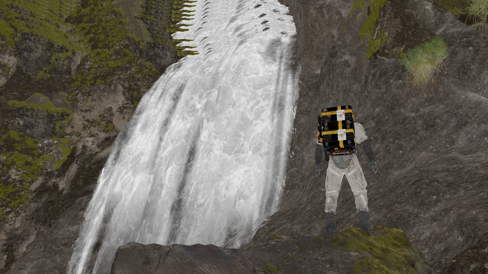

画面里那道白色水流本身——也就是水幕主体——呈现为多条独立"水舌"，之间以深色岩石缝隙分隔，表面充满顺着流动方向延伸的白色泡沫条纹和暗色沟槽。这层视觉效果不是靠几何体的波浪起伏表现的（水幕主体是一块相对平整的落水几何体），而是完全依赖材质里一张流动的法线贴图（见第2节）——这是"用材质动画替代几何复杂度/真实流体模拟"的直接例证。

---

## 1. 系统架构

```
Depth-only Pass（写入共享深度）
        ↓
Colour Pass（多目标GBuffer输出，按顺序绘制）
    ├─ 地形几何：采样"湿润反馈贴图" → 写入 基础色/法线/运动矢量
    ├─ 水花公告板：Buffer驱动实例化 → 软粒子裁剪 → 逐实例调色 → 写入 专用HDR高亮通道
    ├─ [深度拷贝] 场景深度 → 拷贝到独立只读深度纹理，供后续水面采样
    └─ 水幕主体（最后绘制）：采样拷贝出的场景深度 → 双层错位流动法线UV动画 → 软深度裁剪 → 写入 基础色/法线/运动矢量
        ↓
Compute后处理链（含Bloom）
        ↓
最终输出
```

关键设计要点：**水幕主体必须在同一个Colour Pass内、在地形与水花公告板之后最后绘制**，因为它的像素shader需要采样"此刻已经画好的场景深度"做深度相关效果（软裁剪/景深关系判断），这是半透明/需要读取场景状态的材质的标准处理顺序——如果先画水面再画地形，水面就读不到正确的场景深度。地形、水花与水幕主体**共享同一张深度目标**（水幕主体读取的是其拷贝版本），但**各自独占部分GBuffer输出通道语义**（尤其是那个仅特效材质使用的HDR高亮通道），避免相互干扰。

---

## 2. 核心机制一：水幕主体的流动视觉（这是"瀑布"效果本身）

### 2.1 为什么水幕主体是核心，而非湿润/水花

之前的分析容易把注意力集中在"地形变湿"和"水花粒子"这两个视觉上更显眼的局部细节上，但如果只做这两者、不做水幕主体本身，画面里根本不会出现一条"水在往下流动"的瀑布——那两个子系统的前提是**已经存在一片会动的水面**，它们只是叠加在这片水面周围的辅助细节。水幕主体解决的是最根本的问题：**用什么几何体、什么材质，让一片表面看起来像"水正在往下流"**。

### 2.2 几何体：分段的中密度曲面网格

案例中水幕主体由 3 次 `DrawIndexedInstanced` 完成，索引数分别为 18471 / 62898 / 35388（均单实例），换算成三角形约为 **6157 / 20966 / 11796 个**——**这个量级排除了"一块矩形面片"的可能性**（简单面片只需要2个三角形），说明水幕主体是**贴合瀑布崖壁走向拉伸建模、且沿高度/宽度方向切分了不少段的曲面网格**，三次绘制大概是沿宽度方向切成的独立分段（思路上类似地形的分块渲染），不是烘焙进大地形网格里的一块，也不是单一整块几何体。它的顶点结构比地形材质简单：顶点shader只声明了5个输入属性（位置/法线/切线/顶点色/UV），且顶点数据经过一次逐实例矩阵变换（`CB0[instanceid*36 + ...]`路数的矩阵乘法），说明每一段水幕是被当作独立实例摆放的。

**资产制作结论**：水幕主体需要为瀑布单独建模/摆放一套贴合崖壁走向的曲面几何体，面数不需要做到地形级别的精细，但也不是简单矩形面片能替代的——需要有足够的顶点密度让法线扰动动画在曲面轮廓上正确显示，具体分段数量可参照案例的量级（每段约6千~2万个三角形）按自己项目的瀑布尺寸调整。

### 2.2.1 三次水幕 DrawIndexedInstanced：事件、网格与批次关系

本帧水幕主体对应的三次提交是 **event 9135 / 9143 / 9150**，均为 `ID3D12GraphicsCommandList::DrawIndexedInstanced()`，均写入同一组 5 个 GBuffer（`28484/28483/28481/28482/28485`）和主深度 `28489`。它们紧跟场景深度快照 `28490` 的拷贝之后，且 PS 只绑定同一对核心输入（深度快照 `28490`、流动纹理 `6813975`），因此可将其确定为水幕主体批次，而非地形或水花。

| Event | IndexCount × InstanceCount | 三角形数* | VS | PS | 顶点缓冲差异 | 可确认的网格结论 |
|---:|---|---:|---|---|---|---|
| 9135 | 18,471 × 1 | 6,157 | `191858` | `191859` | position/normal 数据来自 `187287`；UV 来自 `112792` | 独立的低规模水幕段 |
| 9143 | 62,898 × 1 | 20,966 | `191858` | `200402` | position `192820`、法线/切线 `205245`；UV 与9135共用 `112792` | 三段中规模最大的独立水幕段 |
| 9150 | 35,388 × 1 | 11,796 | `191858` | `200402` | 与9143使用相同的 VB 资源与布局；`index_offset=62,898` | 与9143同一组索引流中的后续子网格/段 |

\*三角形数以 triangle-list 为前提；本轮 MCP 输出未直接返回 topology，因此严格说这是“按索引数换算的三角形候选规模”。三次合计为 **116,757 个索引、约38,919个三角形**。

模型不是简单 quad：VS 有 position、normal、tangent、vertex color、UV 五类输入，VB stride 分别为 12 / 24 / 8 字节；9135 与9143/9150的顶点数据源不同，而9143、9150共享顶点数据且9150从 `index_offset=62,898` 继续取索引。最稳妥的结论是：**主体由至少两套曲面网格资源组成，其中第二套被索引流切成9143、9150两个提交；三者都是单实例的中密度水幕曲面段。**

> 未确认项：没有 Mesh Viewer 顶点位置/屏幕覆盖证据时，不能把9135/9143/9150标为左、中、右或指定某条水舌；事件编号和索引数不等于空间位置。

### 2.2.2 三次 Draw 的 Shader：相同与不同之处

三次 Draw **共享同一个 VS `191858`**，但 PS 并非同一字节码：9135 使用 `191859`（hash `651fc7c3…`），9143和9150共用 `200402`（hash `ee3b1db0…`）。二者资源绑定、输入输出声明和关键算法相同，区别至少包含若干常量（例如一处深度淡出倍率从约 `3.333333` 变为 `1.724138`）；因此应表述为“同一水幕材质算法的两个参数/变体 PS”，而不是“完全相同的 PS”。

**VS `191858`（三次共用）**：`SV_InstanceID × 36` 计算常量数组基址；再用多次 `mul/mad` 组合每段的矩阵，将位置、法线、切线变换到后续 PS 所需空间。它不生成流动效果，职责是把不同水幕曲面段及其顶点属性送入同一材质流程。

**PS `191859` / `200402` 的已确认指令链**：

```hlsl
// 说明性变量名，不是游戏原始符号名。
perDraw = ShaderInstance_PerInstance[SV_InstanceID * 2];
phase = frac(PerFrame.time * perDraw.flowSpeed * 0.1);     // `frc`，两版均存在

// T1 = 6813975。两次 sample_indexable，第二组 UV 相对第一组再偏移。
uv0 = MakeFlowUV(input.uv, phase, perDraw.uvScaleBias);
s0  = FlowTex.Sample(flowSampler, uv0);
uv1 = MakeFlowUV(input.uv, phase, perDraw.uvScaleBias + offset);
s1  = FlowTex.Sample(flowSampler, uv1);
blendWeight = pow(s1.a, 0.4);                              // `log → mul 0.4 → exp`
flowNormal = BuildAndNormalizeTBNNormal(s0, s1, blendWeight, input);

// T0 = 28490；`ld_indexable` 按屏幕像素坐标读取深度快照。
sceneDepth = DepthSnapshot.Load(int2(screenPos));
fade = CombineDepthDifference(sceneDepth, input.depth, input.uv,
                              input.vertexColor, perDraw);
if (fade <= 0) discard;                                    // `discard_z`

// 5个 MRT 均直接写出；o1 是零值，o2编码法线，o3写屏幕空间差值。
out.rt0 = float4(fadeMask, fadeMask, fadeMask, alphaLikeMask);
out.rt1 = 0;
out.rt2 = EncodeNormal(flowNormal);
out.rt3 = EncodeScreenSpaceDelta(input);
out.rt4 = MaterialMask(fadeMask);
```

这段反编译证明的重点不是“用一张纹理滚 UV”这么笼统，而是：**时间相位 → 两次 `sample_indexable` → 基于 alpha 的幂曲线混合 → TBN 法线重建 → 深度快照 `ld_indexable` → `discard_z` → 多 MRT 写入**。其中 `flowSpeed`、`MakeFlowUV`、`CombineDepthDifference` 等是为阅读创建的解释名称；只能确认指令关系，不能把它们当作游戏源码变量名。

### 2.2.3 三次主体 Draw 的贴图与非纹理输入

| 输入 | 9135 | 9143 | 9150 | 已确认的 Shader 用法 | 作用与边界 |
|---|---|---|---|---|---|
| `28490` 深度快照 | T0，3840×2160 `D32S8_TYPELESS` | 同 | 同 | `ld_indexable` 按屏幕坐标读取，参与深度差和 `discard_z` | 处理水幕与既有场景的深度融合；其存在并不单独证明“软边透明”或具体 Blend 状态 |
| `6813975` 流动纹理 | T1，2048²、12 mip、`BC7_UNORM` | 同 | 同 | 两次 `sample_indexable`；RGB进入法线重建，alpha参与幂曲线混合/遮罩 | 提供流动表面细节与扰动；水幕的宏观轮廓仍由曲面网格决定 |
| `Scratch_PerFrame` | CB0，496B | 同 | 同 | 提供时间项（反汇编中参与 `×0.1 → frc`） | 驱动循环流动相位 |
| `Scratch_PerView` | CB1，832B | 同 | 同 | 提供屏幕/投影/深度转换参数 | 将场景深度与当前像素深度放入同一比较空间 |
| `ShaderInstance_PerInstance` | CB2，8160B/510 float4 | 同 | 同 | 动态索引；提供UV缩放、速度、遮罩与变体参数 | 三次提交虽均为1实例，但常量数组容量大；其完整作者意图仍待确认 |
| 顶点数据 | `187287` + `112792` | `192820` + `205245` + `112792` | 同9143/9150 | position、normal/tangent、vertex color、UV进入 VS/PS | 证明水幕不是单纯屏幕面片；9143/9150共享一套顶点流但使用不同索引区间 |

**贴图结论**：三次主体 Draw 的核心纹理输入不是三套不同贴图，而是共享的“深度快照 + 流动 BC7 纹理”两项。每段的差异主要来自网格索引区间、顶点流和常量数据，而不是换了一张水纹理。

### 2.3 材质类型：不透明GBuffer材质 + Alpha-to-Coverage伪半透明

**真正的实现是"不透明GBuffer写入 + Alpha-to-Coverage (A2C) 伪半透明"**——这是一种延迟渲染管线特有的中间状态。


视觉上的"水流中段也有半透感"主要来自A2C，边缘的柔和过渡来自discard_z（软深度裁剪），加上流动法线贴图的明暗起伏——三件事叠加出来的综合效果，几何体本身（mesh有缝的水舌造型）则让岩壁在主要水舌之间直接露出来。

**复用建议**：在自己项目的延迟渲染管线里想复刻类似效果，水幕主体应该设置成"不透明GBuffer材质 + alpha-to-coverage enabled"——不需要走真半透明forward通道（那样要单独处理GBuffer之外的合成逻辑，复杂度陡增），但要让alpha通道写入**经过计算的逐像素不透明度**（不是简单阈值），并保证后续TAA开启让A2C的dither pattern能多帧平均出来。这套方案比纯不透明多一层半透感，又比真半透明省很多复杂度，是延迟渲染里性价比最高的折中。

### 2.4 核心技巧：双层错位UV流动法线动画

这是让水面"看起来在流动"的关键实现，且成本极低——**没有使用真实流体模拟，只用一张法线贴图配合时间驱动的UV偏移**：

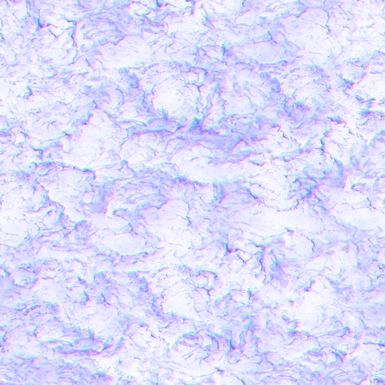

像素 shader 的核心逻辑（伪代码化后）：

```
phase = frac(globalTime * perInstanceSpeed * 0.1)      // 时间驱动的循环相位，每个实例可有不同速度
uv_A = baseUV + phase                                   // 第一层偏移采样
normal_A = sample(flowNormalTex, uv_A)
uv_B = baseUV + phase + 0.5                              // 第二层错位半个周期
normal_B = sample(flowNormalTex, uv_B)
weight = pow(abs(phase - 0.5) * 2, someExponent)         // 用于两层之间的混合权重
finalNormal = lerp(normal_A, normal_B, weight)           // 混合，消除UV循环时的接缝跳变
```

**为什么要两层错位采样**：如果只用一层UV滚动，相位从1循环回0的瞬间贴图会突然跳变（明显的接缝闪烁）。用两层相位相差半个周期的采样并做权重混合，可以保证任意时刻至少有一层采样处于"稳定期"，混合权重随时间平滑过渡，从而消除跳变——这是水面/河流类流动UV动画的标准手法，几乎零额外美术成本（复用同一张贴图，只是多采样一次+混合）。

裁剪出的水幕主体局部画面可以看到这个技巧的最终效果——顺着水流方向延伸的连续泡沫条纹和暗色沟槽，正是法线扰动带来的明暗起伏：


**复用建议**：这是本方案里性价比最高的技巧，建议直接复用到自己项目——制作或购买一张"流动感"法线贴图（岩石状/波浪状高频噪声即可，不需要专门画瀑布），shader里实现"双层错位UV+相位混合"逻辑，即可让任意水面/河流/瀑布几何体产生令人信服的流动视觉，不需要顶点动画、不需要流体模拟、不需要额外几何精度。

### 2.5 深度交互：拷贝场景深度供水面读取

在水幕主体绘制之前，紧跟着一次`CopyResource`，把当前场景深度（此时已包含地形和水花公告板）整份拷贝到一张独立的只读深度纹理。水幕主体的像素shader里，这张拷贝深度是唯一绑定的贴图输入之一（配合`ld_indexable`直接读取深度值，而非通过采样器插值），紧接着做了软深度裁剪判断（`discard_z`，与水花公告板用的软粒子技术是同一种手法）。

**为什么需要拷贝而不是直接读主深度**：水幕主体在同一个Pass里既要**写入**自己的深度（更新GBuffer），又要**读取**"绘制之前已经存在的场景深度"做效果判断——如果直接绑定主深度纹理作为渲染目标+着色器输入，会违反大多数图形API"同一资源不能同时作读写目标"的限制（或至少导致读取到的是不完整/正在写入中的数据）。所以标准做法是先把当时的深度状态拷贝一份出来当只读输入，主深度纹理继续正常作渲染目标写入。

**复用建议**：任何需要"读取当前场景深度、同时又要继续写入自己深度"的材质（水面、玻璃、其他需要软裁剪或深度融合效果的半透明材质），都应该采用这个"渲染前先拷贝一份深度快照"的模式，而不是想办法绕过读写冲突。

### 2.6 存疑：逐实例参数变体数组与实际实例数不一致

水幕主体的像素shader里，用`SV_InstanceID`转发值去索引一个多达255组的"每实例静态参数"常量数组（`ShaderInstance_PerInstance`常量缓冲区），但本次分析里对应的3次绘制调用的`num_instances`字段读到的都是1。这两个数字对不上——可能是水幕被拆成了255个静态子网格分别单独提交绘制（每个子网格对应数组里的一格，只是本次分析只覆盖到其中3次），也可能是分析工具读取到的实例数字段本身不准确（该工具在其他地方也出现过字段解析问题）。**这一点不下确定结论，如果需要精确复刻，建议后续针对同一片水幕，把所有相关的绘制调用（本次可能未穷尽）都截取出来逐一核对，而不是只依据本次抓到的3次调用。**

---

## 3. 核心机制二：地形动态湿润反馈系统

### 3.1 湿润不是“水花 Draw 的一部分”：它是独立的全屏反馈 Pass

湿润部分不能像主体水幕和水花一样给出一个确定的 `DrawIndexedInstanced event`：本次已有证据指向的是**独立的全屏反馈 Pass**，而不是某个水花实例 Draw。其目标资源为 `WDMaps`，规格为 **512×512、R16_UNORM**；该 Pass 的像素 shader 仅有约6条有效指令，核心是“读上一帧 WDMaps → 乘顶点色衰减 → 写本帧 WDMaps”。当前 MCP 报告未保留这个 Pass 的精确 event ID，因此不能编造一个编号；但它的资源、shader逻辑和地形读取端已经具备同级拆解证据。

| 模块 | 直接证据 | 实现结论 | 未确认项 |
|---|---|---|---|
| 写入 Draw/Pass | 全屏 Pass；PS 采样上一帧 WDMaps 并乘顶点色 | 运行时 feedback/ping-pong 更新，不是静态美术贴图 | 当前报告未保留精确 event ID、写入 RT resource ID |
| 反馈资源 | `WDMaps`，512²，`R16_UNORM` | 用单通道低频数据累计局部湿润 | 双缓冲资源的具体交换时机 |
| 衰减 | 顶点色 `v2` 原样传入 PS 并参与乘法 | 衰减被放在全屏 quad 的顶点数据，而非 shader 常量 | 顶点缓冲原始数值尚未读取 |
| 地形读取 | shader 对 WDMaps 做4次 `sample_c_lz` 2×2 PCF | 干湿边界通过 PCF 软化，而非二值阈值 | 具体阈值/半径数值 |
| 全局天气关系 | 常量读取到 `mWetness=0`，局部湿润仍存在 | WDMaps 局部系统独立于全局天气 | 与其他环境变量是否存在间接耦合 |

维护一张独立的低分辨率渲染目标，记录地形表面的"湿润程度"，通过**帧间反馈循环**实现类似流体累积/扩散/消退的视觉效果，而不需要真正的流体模拟。

工作循环（每帧）：

```
读取上一帧湿润贴图
  → 与本帧新增的水体交互区域叠加
  → 乘以衰减系数（实现随时间变淡）
  → 写入本帧湿润贴图
```

这是典型的 **ping-pong 反馈贴图**模式：一张贴图既是本帧的写入目标，又是下一帧的读取来源。

### 3.2 关键实现细节

**贴图规格**：单通道即可（本案例用 R16_UNORM），不需要RGBA。分辨率远低于屏幕分辨率（512²对3840×2160屏幕），因为湿润是低频信息，不需要像素级精度。这是成本最低的方案之一——一张 512² 单通道贴图仅 0.5MB，全屏Pass开销可忽略。

**衰减机制**：不建议把衰减系数写进 shader 常量或材质参数（案例中该值被写死在驱动这次绘制的顶点颜色数据里，属于反面案例——不便于美术调节）。**推荐做法**：把衰减速率暴露为材质实例参数或蓝图可调变量，本质是一个简单的指数衰减：

```
湿润(t) = 湿润(0) × decay^t     // decay 略小于1，如0.97~0.99，每帧相乘
```

decay 越接近1，湿润消退越慢；需要给美术提供的调节维度是"湿润完全消退所需的秒数"，反推出对应的逐帧 decay 值。

**读取端的软化处理**：地形材质采样湿润贴图判断"这个像素有多湿"时，如果直接用采样值做硬阈值判断，干湿分界线会出现锐利硬边。案例中的解决方案是**直接复用阴影贴图的PCF（百分比渐近滤波）算法**：以采样点为中心做 2×2 邻域采样、加权平均后再和阈值比较，比较对象由"光源深度"换成"湿润值"。

**复用建议**：如果引擎已经有阴影PCF的shader函数，直接把采样源换成湿润贴图即可复用，不需要重新实现一套软化算法——这是本案例最值得直接搬运的技巧。

**图2：湿润反馈贴图实际内容（原始数据 vs 拉伸对比度）**


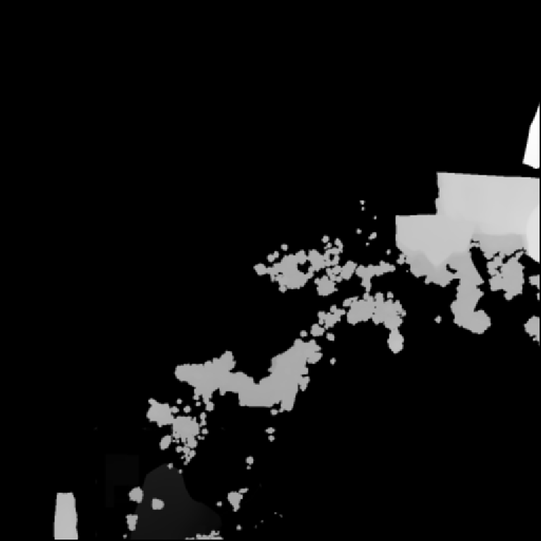

左图是贴图原始16bit数值直接映射的结果，几乎全黑——说明该反馈贴图的实际写入值长期停留在动态范围的低区间；右图经过对比度拉伸后才能看清沿水流路径扩散的团块状湿润痕迹。这一现象与"每帧乘以小于1的衰减系数做指数衰减"的机制吻合：只要衰减系数持续生效，稳态数值就会自然维持在较低区间，难以触及数值上限。**参考意义**：验证自己项目的反馈贴图实现是否符合预期时，不要只看拉伸后的可视化结果，也应检查原始数值分布是否处于合理区间，避免因为精度或衰减速率设置不当导致贴图在中后期数值溢出或过早归零。

### 3.3 与全局天气系统的关系

本案例验证了该湿润系统与全局天气/环境参数（温度、降水强度、全局湿度）完全独立：全局降水/湿度可以是0，瀑布周边的局部湿润效果依然正常工作。

**架构建议**：局部水体交互湿润效果应设计为独立于全局天气系统的子系统，仅关心"角色/水体是否经过此处"，不应该依赖或耦合全局天气状态，否则会导致无雨天气下瀑布/河流边缘的湿润反馈失效。

---

## 4. 核心机制三：水花公告板粒子系统

### 4.1 水花对应的 DrawIndexedInstanced：event 9104（与水幕同级拆解）

水花/水雾候选对应 `Colour Pass #2` 的 **event 9104**：`DrawIndexedInstanced(6, 172)`，写入 `28484/28483/28481/28482/28485` 与主深度 `28489`。它不是水幕的三个 Draw 之一，而是一条独立的实例化粒子管线。

| 项目 | event 9104 的直接证据 | 结论 |
|---|---|---|
| 基础网格 | `6 indices × 172 instances`；VB stride 为 8 / 20 / 8 字节 | 在 triangle-list 前提下为2三角形 quad；仍需 topology 字段/mesh viewer 做最终确认 |
| VS | `37881`；`T0=InstanceData/ScratchResource_Upload`，长度约130MB；`SV_InstanceID` 参与 `imad` 地址计算与多次 `ld_indexable` | 每个实例从 buffer 取位置/矩阵数据，而非172个独立 mesh |
| 相机朝向证据 | 常量中存在 `mCameraFacingMatrix`；VS 用模型/视图/投影矩阵变换局部四边形 | 支持 camera-facing billboard 解释，但未做逐实例屏幕可视化 |
| PS | `37916`；双主深度绑定、主贴图/LUT/纹理数组等资源 | 同一个 quad 批次在 PS 完成形状、深度融合和外观变化 |
| 输出 | 5 MRT + 深度 `28489` | 与几何 Pass 同组输出；`28483` 为专用 HDR 高亮通道的强候选 |

### 4.1.1 水花 VS/PS 反汇编解读

该 Draw 的 VS/PS 反汇编已确认以下数据流。下列伪代码是按指令职责添加注释的可读版本：变量名为说明性命名，不是原始符号名。

```hlsl
// VS：每个实例都复用同一个 quad，仅从 InstanceData 读取差异。
particle = InstanceData[SV_InstanceID];
localQuad = ReadQuadVertex(input.vertexID);
worldPos = particle.position + CameraRight * localQuad.x * particle.size
                            + CameraUp    * localQuad.y * particle.size;
output.position = ViewProjection * float4(worldPos, 1);
output.uv = localQuad.uv;
output.colorIndex = particle.colorIndex;

// PS：[A] 采样 512² BC7 贴图；RGB 提供法线扰动，A 提供柔边形状。
sample = SplashNormalAndMask.Sample(sampler, input.uv);
normal = DecodeNormal(sample.rgb);
shapeAlpha = sample.a;

// PS：[B] 读取场景深度，计算粒子到不透明场景的交界淡出。
sceneDepth = MainDepth.Load(pixelCoord);
softFade = saturate((sceneDepth - input.depth) * softParticleScale);
if (shapeAlpha * softFade <= 0) discard;

// PS：[C] 逐粒子标量映射小型颜色 LUT，得到生命周期/类型差异颜色。
color = ColorLUT.Sample(lutSampler, float2(input.colorIndex / 255.0, 0.5));

// PS：[D] 基础色/法线等写入 GBuffer；HDR 值额外放大后写入专用高亮 RT。
out.baseColor = color * shapeAlpha;
out.normal = EncodeNormal(normal);
out.hdrHighlight = color * 10.0 * shapeAlpha;
```

**实现链路的关键点**：`[A]` 将“轮廓”和“表面起伏”压进同一张 RGBA 纹理；`[B]` 是软粒子深度裁剪；`[C]` 用实例 buffer 中的一个标量决定颜色而非在 shader 内随机；`[D]` 才是水花产生 Bloom 泡沫感的直接原因。该拆解与水幕主体不同：水幕的核心是中密度曲面+流动法线，而水花的核心是“一个 quad × 大量实例 + 深度融合 + HDR 输出”。

### 4.1.2 水花 Draw 绑定贴图与资源作用

| 资源 | 绑定/规格证据 | 反汇编中的角色 | 对最终视觉的贡献 |
|---|---|---|---|
| `inSampler0` 水花主贴图 | 512²、BC7 UNORM；已导出预览 | 采样 RGB 法线数据与 Alpha 形状遮罩 | RGB 令亮区有细碎泡沫起伏；Alpha 决定不规则、柔边的飞溅轮廓 |
| 主深度 `28489` | PS 读取两次 | 深度比较与软粒子淡出 | 消除公告板与岩壁/地面相交时的硬直线 |
| 颜色 LUT | 32×4 小纹理 | 由逐实例标量归一化后索引 | 让不同粒子按生命周期或类型获得不同色调，无需增加 shader 分支 |
| `TextureArray 37015` | 128×256×10 层，BC7 数组 | 同一 PSO 的可用形状资源 | 本帧无法完全证明其采样分支已执行；切片形状更像可复用的局部印记模板，应与水花主贴图区分，不应直接当作水花形状结论 |
| `InstanceData` / 每实例常量 | VS 读取 | 位置、尺寸、颜色索引等逐实例数据入口 | 决定粒子数量、分布和个体差异，是水花动态变化的核心数据源 |

> **精度边界**：event 9104 的“相机朝向公告板”已由 VS 的逐实例位置读取和相机相关变换得到支撑；但 172 个实例中每一个究竟是“水花”还是“水雾”、以及 `TextureArray 37015` 是否在这一帧的实际动态分支中被取样，仍缺少按实例/像素的执行追踪。因此本文将该 draw 定义为“瀑布落点水花/水雾公告板批次”，不把所有绑定资源都强行解释为水花素材。

### 4.2 实例化与位置驱动

水花采用面向相机的公告板（Camera-facing billboard），每个公告板仅 6 个顶点索引（2个三角形），通过一次 `DrawIndexedInstanced` 完成全部实例的绘制（案例中172个实例，1次draw call）。

**关键设计**：每个实例的空间位置**不是**写死在顶点缓冲区里的，而是在顶点 shader 中从一个独立的 `InstanceData` buffer 按实例ID索引读取。这是**数据驱动的实例定位方案**，位置数据可以由CPU侧逻辑（碰撞检测、水流采样点）或GPU侧计算（compute shader预处理）预先写入这个buffer，渲染阶段只负责读取和绘制。

**复用建议**：无论水花来源是脚本放置点、粒子发射器还是流体模拟采样点，只要能把"这一帧需要绘制水花的位置列表"写进一个 structured buffer，就能复用这套"一次 draw call、buffer驱动、GPU 侧读取偏移"的方案，避免CPU侧逐个提交draw call的开销。

**图3：水花贴图 RGBA 四通道拆分**

| R（法线X） | G（法线Y） | B（法线Z基准） | Alpha（形状遮罩） |
|---|---|---|---|
| 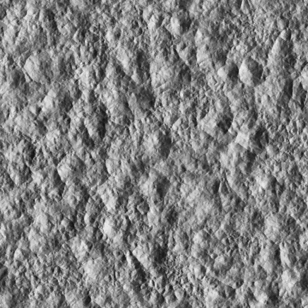 | 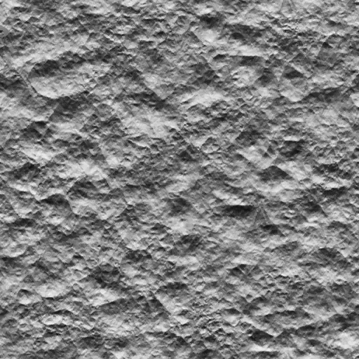 | 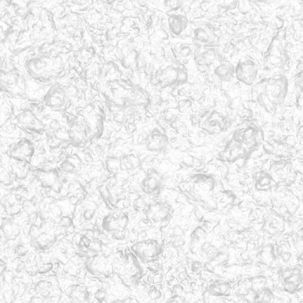 | 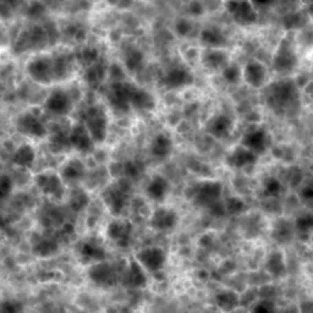 |

R、G 两通道均为高频岩石状噪声，构成法线扰动的XY分量；B通道整体明亮且低对比度，符合法线"基本朝外"的Z分量特征；Alpha通道则是完全独立的云雾团块状柔边形状，与RGB的岩石纹理毫无关联。**参考意义**：形状遮罩（决定"哪里有水花"）与表面细节（决定"水花表面质感"）被拆分进两组独立无关的通道设计，二者可以分别调整而不互相牵连——制作类似效果的贴图时，建议同样把"轮廓形状"与"表面细节噪声"分离设计，便于后期单独调整水花的形态范围或表面质感而不互相影响。

### 4.2 软粒子深度裁剪

公告板与背后地形之间存在深度差时，若不处理会出现公告板边缘与地形表面的锐利直线穿插。解决方案是**软粒子技术**：在像素 shader 中比较当前像素深度与场景深度的差值，差值过小时按比例裁剪/淡出该像素，差值足够大时正常显示。

这是业界标准手法，建议本项目粒子系统统一实现一次通用的软粒子裁剪函数，供所有半透明/公告板类效果复用，不需要为水花单独写。

### 4.3 独立HDR高亮通道设计

**核心设计**：水花的"发亮/泡沫感"不依赖贴图本身的亮度，而是在像素 shader 输出阶段将颜色值主动放大（案例中放大10倍）后写入一个**独立于主颜色通道的高动态范围（HDR）GBuffer目标**（案例格式为 R11G11B10_FLOAT，无需 Alpha 通道，正好匹配"只要亮度不要透明度"的需求）。

这个高亮通道**只有水花/半透明特效材质写入，普通地形/不透明材质完全不写**，形成清晰的功能分区。渲染管线后段的 Bloom 后处理读取这个通道，让超出0-1范围的高亮度数值自然产生辉光溢出效果。

**复用建议**：
1. 如果本项目GBuffer已有专门的自发光/emissive通道，可以直接复用，不需要新增
2. 如果没有，建议新增一个不含Alpha的中等精度浮点格式通道（如 R11G11B10F），仅供特效类材质写入高亮度数值，与不透明几何体的PBR通道物理隔离，防止相互覆盖或语义混淆
3. 亮度倍数应做成材质可调参数，不要硬编码在shader里（案例中硬编码为10，属于不便于调节的反面示例）

### 4.4 逐实例外观变化：Instance Buffer + 颜色LUT

每个水花实例的具体色调不是随机在shader里生成，而是从驱动该实例的 `InstanceData` buffer 中读取一个逐实例标量（很可能是该粒子的生命周期百分比或类型索引），归一化后作为横向坐标去查询一张小尺寸颜色渐变查找表（LUT，案例中为32×4像素）：


**复用建议**：这是性能与美术自由度平衡的经典手法——**用一个逐实例标量+一张小LUT贴图，代替在shader里写死的颜色插值逻辑**。美术可以直接在图像编辑软件里重新绘制LUT的渐变条来调整整体色调，不需要程序改代码重新编译shader，也不需要为每种颜色变化单独写分支逻辑。建议本项目粒子/特效系统统一采用这套"实例标量 + LUT" 模式驱动逐实例的颜色、大小或其他外观变化。

### 4.5 可扩展方向：贴花形状库复用于其他局部交互效果

水花公告板绑定的纹理输入中，除主要的噪声贴图外，还发现一张小尺寸纹理数组，两个切片呈现出与"飞溅水花"明显不同的规整轮廓（分别接近鞋履印记轮廓、水滴/椭圆轮廓）：

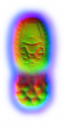
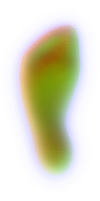

这类规整轮廓不符合水花应有的不规则飞溅形态，更符合"贴花（decal）形状模板"的特征。结合水花公告板本身"Buffer驱动实例化 + 逐实例LUT调色"的通用架构，一个合理推断是：**同一套公告板贴花渲染管线可能被复用于多种局部交互印记效果**（水花、湿脚印、水面涟漪等），只需切换纹理数组的采样切片和调整实例数据即可扩展新的效果类型，不需要另起一套渲染路径。

**复用建议**：如果本项目也需要"角色/物体经过水体后留下短暂印记"类效果（如湿脚印、水花痕迹、涟漪扩散），建议不要为每种效果单独建立公告板系统，而是设计一套通用的"实例化贴花渲染管线"——公共部分为 Buffer驱动定位 + 软粒子裁剪 + 逐实例LUT/纹理索引，差异部分仅为一张形状图集（每种效果对应图集中的一个区域或数组切片）与对应的生成/消退逻辑。这样新增一种局部交互印记效果时，只需新增贴图内容与生成时机，不需要新写渲染代码。

---

## 5. GBuffer 通道设计参考

案例引擎使用5个渲染目标构成 GBuffer，通道分工如下（可作为本项目GBuffer布局设计的参考）：

| 通道 | 格式建议 | 用途 | 写入方 |
|---|---|---|---|
| 基础色 | R8G8B8A8_SRGB | 最终反照率/基础色 | 所有材质 |
| 特效高亮通道 | R11G11B10_FLOAT（无Alpha） | 半透明/粒子类效果的HDR自发光输出 | 仅特效材质，不透明地形不写 |
| 表面法线 | R16G16_UNORM | 编码后的法线XY（Z由推导重建） | 所有材质 |
| 运动矢量 + 自定义标量 | RGBA16F | RG=屏幕空间运动矢量（当前/上一帧位置透视除法差值），B=各材质自定义强度值 | 所有材质，B通道含义因材质而异 |
| 材质附加通道 | R8G8B8A8_UNORM | 预留给粗糙度/AO等PBR附加参数 | 所有材质 |

**设计原则**：将"仅特效类材质使用"的通道与"所有材质共用"的通道明确区分，避免不透明几何体误写高亮通道导致画面异常发光，也避免特效材质因为要凑齐所有通道输出而增加不必要的shader复杂度。

**图4：GBuffer各通道实际内容可视化**

| 通道         | 可视化                                                                                               | 验证结论                                                                                                                                                            |
| ---------- | ------------------------------------------------------------------------------------------------- | --------------------------------------------------------------------------------------------------------------------------------------------------------------- |
| 表面法线       | 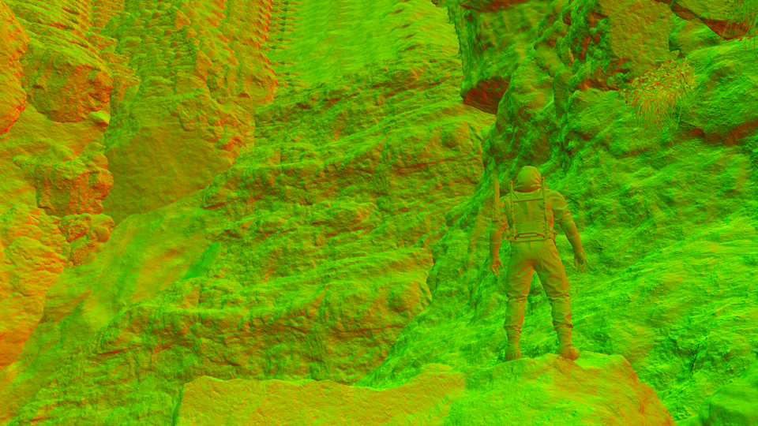                                                      | 呈现标准切线空间法线编码特征（朝上/朝相机区域一种色调，侧面区域另一种色调）。植被（灌木/杂草）区域法线噪声密度明显高于岩体，说明细节法线可以独立于宏观几何法线叠加，验证了"法线通道可承载远超几何精度的表面细节"这一常见延迟渲染优势                                            |
| 特效高亮通道     |                                                | 全画面几乎纯黑，仅水花所在的一小片区域出现亮值。**直接验证了"仅特效材质写入、不透明地形完全不写"的分区设计是有效的**——如果分区设计不当，这类通道往往会出现不该有的大面积残留值                                                                     |
| 运动矢量+自定义标量 | 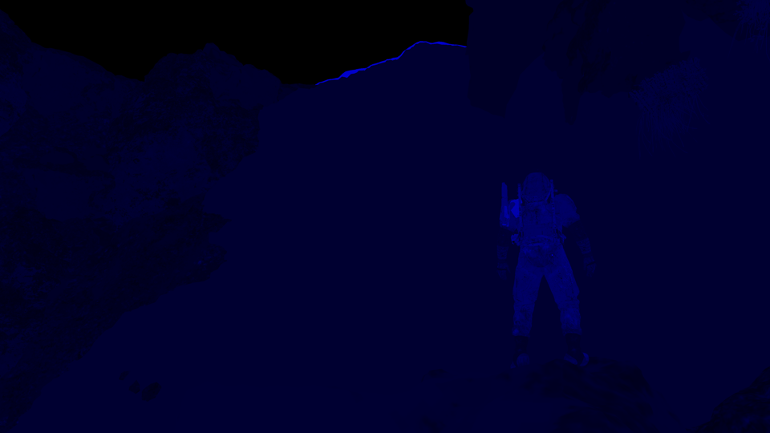                                              | 静止场景下整体接近全黑（运动矢量≈0），但角色轮廓边缘出现清晰的非零色调——即使角色站立不动，待机动画（呼吸/摇晃等细微姿态变化）仍会产生逐像素的非零运动矢量。**参考意义**：验证自己项目运动矢量通道实现正确性时，静态角色/待机动画角色的边缘应当能观察到类似的非零信号，全黑反而说明运动矢量没有正确捕捉细粒度姿态变化 |
| 材质附加通道     | 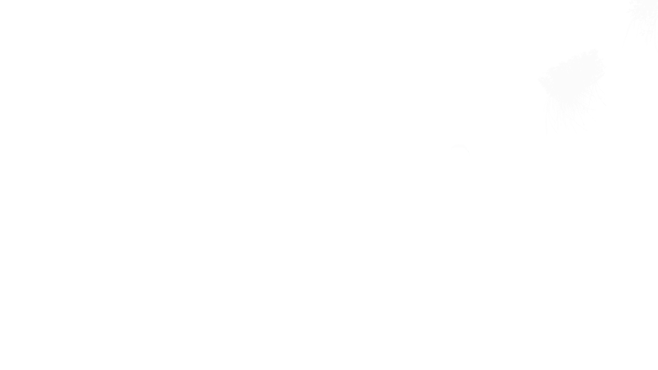  | RGB分量在露天区域内高度一致且接近数值上限，Alpha分量则接近0，符合AO（环境光遮蔽）类数据"露天无遮蔽处趋近满值"的特征，但未能逐位确认，故第8节仍将其列为已知限制                                                                          |

---

## 6. 实现要点清单

复刻或参考本方案时的关键决策点：

- [ ] **瀑布的视觉主体优先用"独立几何体 + 双层错位UV流动法线贴图"实现，不要试图用地形材质的静态细节表现流动感**，这是决定"看起来像不像在流动"的核心，比湿润/水花更优先
- [ ] 水幕主体几何体不要用简单矩形面片替代，需要贴合水流路径与崖壁走向拉伸建模，保留中等密度分段，否则法线扰动动画在曲面上会显示不正确
- [ ] 水幕主体材质走**不透明GBuffer写入 + Alpha-to-Coverage伪半透明**实现通透感，alpha通道要按多层逻辑（深度+UV+顶点色+每实例参数）计算逐像素不透明度，依赖后续TAA/A2C抖动采样消费，不需要也不应该走传统半透明混合模式
- [ ] 流动UV动画使用两层相位相差半周期的错位采样并做权重混合，避免UV循环时的接缝跳变
- [ ] 需要读取"当前已绘制场景深度"的材质（水面/玻璃等），使用"绘制前拷贝一份深度快照"的模式，不要尝试对同一深度资源同时读写
- [ ] 湿润/水痕反馈贴图使用低分辨率单通道格式，通过 ping-pong 全屏Pass实现帧间累积与衰减，不需要真实流体模拟
- [ ] 衰减速率暴露为可调参数（如"消退秒数"），不要写死在着色器指令或顶点数据里
- [ ] 湿润读取端复用已有的阴影PCF软化算法，避免重新实现边缘柔化逻辑
- [ ] 局部水体交互效果与全局天气系统解耦，避免无雨场景下功能失效
- [ ] 水花/粒子位置通过 Structured Buffer 驱动，实现单次 draw call 渲染大量实例
- [ ] 深度差软裁剪做成通用函数，供全项目所有需要软边效果的不透明/半透明材质复用（水面主体和水花公告板可共用同一个函数）
- [ ] GBuffer 中划出一个不透明材质禁止写入的专用HDR高亮通道，供特效走 Bloom 管线
- [ ] 高亮倍数、密度、实例大小等参数全部暴露为材质/蓝图可调值
- [ ] 逐实例外观差异优先用"实例标量 + 小尺寸LUT贴图"方案，兼顾性能与美术自由度
- [ ] 水花/贴花类局部交互效果考虑设计为通用实例化渲染管线，仅替换形状图集与生成逻辑即可扩展新效果类型（脚印/涟漪等），避免每种效果重复搭建一套系统

---

## 7. Mesh 与材质资产结构

本节回答"这套效果对 Mesh 和材质资产本身有没有特殊要求"，供美术/资产制作参考。**结论：水幕主体需要独立几何体和专用简化材质，地形和水花的 Mesh/材质本身都不特殊，特殊之处全部在渲染管线的数据驱动与采样逻辑上。**

### 7.1 水幕主体 Mesh：独立几何体，中等密度曲面而非简单面片

与地形和水花不同，水幕主体**需要一块独立于地形的几何体**（案例中由3次独立的draw call完成，分别是不同的水幕分段，三角形数量分别约6157/20966/11796，属于中等精度网格量级），不能指望在地形网格上通过材质技巧"画出"流动效果，也不能用一块简单矩形面片替代——面片精度不足以让法线扰动动画在贴合崖壁凹凸走向的表面上正确显示。几何体应贴合水流路径的实际走向拉伸建模，并保留足够的分段密度，顶点属性是标准五件套，没有特殊要求。

**资产制作结论**：瀑布视觉主体的几何体需要美术单独摆放/建模，形态贴合水流路径与崖壁走向，面密度可参考案例量级（每个分段约6千~2万个三角形，具体按瀑布实际尺寸缩放），不需要精细雕刻水花细节（细节由材质动画表现），但也不能简化成一块平面。

### 7.2 地形本体 Mesh：标准地形分块，无特殊要求

瀑布周边地形是常规的静态地形网格，顶点属性为标准五件套：**位置、法线、切线、顶点色、UV**，没有骨骼、顶点动画或程序化生成的特征。地形按分块（tile/chunk）方式组织渲染，瀑布区域与其他地形块共用同一套分块规则，索引数量在同一量级（案例中相邻几个分块索引数为18930~25128），**没有为瀑布单独切出特殊拓扑或加密网格**。

**资产制作结论**：瀑布落水区域周边的地形 Mesh 按常规地形制作标准处理即可，不需要额外的顶点属性、不需要为水流路径单独建模几何体（水流路径的几何体是水幕主体，见7.1）。

### 7.3 水花 Mesh：极简几何 + 数据驱动定位

水花视觉元素在几何层面极其简单：每个水花公告板仅由 **6 个索引、2 个三角形**构成的面向相机四边形，所有水花实例通过一次 Draw Call 批量绘制。

**关键区别在于定位方式，不在 Mesh 本身**：每个实例的世界坐标不是从常规顶点缓冲区读取，也不是美术在 DCC 软件里摆放或用顶点色/骨骼驱动的，而是渲染时按实例 ID 从一个外部 Structured Buffer 中动态读取。这个 buffer 里的位置数据来自渲染管线之外的逐帧计算（大概率是碰撞检测或 GPU compute 对水流路径的采样结果），Mesh 本身只是被反复实例化绘制的一个"空壳"。

**资产制作结论**：水花公告板 Mesh 直接使用项目现有的最简单四边形/公告板资产即可，无需为水花单独制作专用几何体。实现工作量集中在"如何生成水花的位置数据流"这套逻辑管线上，与 Mesh 资产制作无关。

### 7.4 水幕主体材质：简化专用材质，不透明GBuffer + Alpha-to-Coverage伪半透明

与地形的标准三层混合材质不同，水幕主体使用的是一套**结构简化的专用材质**：像素shader只绑定了2个贴图输入（拷贝深度 + 流动法线贴图），远少于地形材质的12张贴图输入，也没有走AO/Color/Normal/Reflectance/Roughness的标准分层混合逻辑。**关键的材质类型澄清**：这套材质从blend state和shader输出看是"不透明"路径（无混合方程、写入不透明GBuffer目标），但alpha通道**不是简单占位值**——是经过屏幕深度差/UV边距/每实例参数/顶点色遮罩等**多层计算**的逐像素不透明度信号，被后续MSAA/TAA的Alpha-to-Coverage抖动采样消费，视觉上做出半透效果。这是一种延迟渲染管线里特有的"不透明写入路径+半透视觉"折中方案（详见2.3节），比纯不透明多了通透感，比真半透明forward通道又省了独立合成逻辑，保留了GBuffer批量写入的批处理优势。

**资产制作结论**：水面/瀑布类材质不应该套用地形的标准分层PBR材质模板，应该为其设计一套独立的、更轻量的"**不透明GBuffer材质 + A2C**"结构——核心输入只需要一张流动法线贴图和场景深度，不需要凑齐完整的PBR贴图组，**也不需要**走传统半透明混合模式，但alpha通道要按多层逻辑（深度+UV+顶点色+每实例参数）精细写入经过计算的不透明度值，依赖后续TAA/A2C实现半透感。

### 7.5 地形材质：标准三层混合材质 + 一张额外贴图

瀑布周边地形使用的材质是引擎标准的**三层混合 PBR 材质**，每层贴图齐备（AO / Color / Normal / Reflectance / Roughness），与场景内其他地形材质结构完全一致，**不是专门为瀑布定制的"水体材质"**。

材质相比标准地形材质唯一的额外之处，是多绑定了一张湿润反馈贴图（见第3节），并在采样时复用阴影PCF算法做软化处理。这一步与三层混合逻辑是**解耦的**——湿润效果作为一层独立的采样与混合逻辑叠加在标准材质结果之上，不改变原有的分层混合结构。

**资产制作结论**：美术制作地形材质时按标准三层混合流程即可，不需要为瀑布区域重新设计材质分层方案。技术上只需要在这套标准材质的 shader 里额外接入一路湿润贴图采样，即可让任意现有地形材质获得湿润过渡能力，具备跨材质复用性。

### 7.6 水花材质：常规贴图输入 + 一处硬编码需要暴露为参数

水花材质的贴图输入是常规做法：一张法线扰动贴图（RG通道为法线XY、B通道为固定朝外基准值）叠加一张Alpha遮罩，用于公告板的表面细节和透明度裁剪，属于粒子/特效材质的常规配置，没有特殊贴图格式要求。

材质里唯一需要资产制作方注意的反常规实现，是像素颜色在写入HDR高亮通道前被硬编码放大了固定倍数（案例中为10倍），这个倍数当前不是材质可调参数。**建议本项目实现时将这个亮度倍数暴露为材质实例参数**，否则美术每次调整水花发光强度都需要改shader代码重新编译，而不是在材质编辑器里滑动一个数值。

---

## 8. 已知限制

以下细节在当前分析深度下未能完全确认，供后续需要更精确复刻时参考：

- **水幕主体blend state原始值未直接读到，无法100%确证"完全不开启Alpha Blend"**：2.3/7.4节判定为"不透明GBuffer写入 + Alpha-to-Coverage伪半透明"，基于shader输出无混合方程（证据等级A）+ alpha通道写入经过多层计算的逐像素不透明度信号（证据等级A）+ 视觉上水流中段有半透感（说明一定存在某种"半透机制"，纯不透明解释不了，证据等级A）。但blend state是否真的关掉、alpha-to-coverage是否在引擎里真的开启、`PipeState.GetColorBlends()`这个接口这次工具没暴露，原始值读不到。如需精确复刻建议后续为工具补充这个接口，或在引擎编辑器里直接检查该材质设置
- **水幕主体的逐实例参数变体数组（255组）与实测实例数（3次draw call，均为单实例）对不上**，具体原因未确认（见2.6节），如需精确复刻建议后续补充穷尽性抓取
- 水幕主体流动UV的具体速度/相位参数数值未逐一提取（已确认公式结构，如`frac(time * speed * 0.1)`，但每个实例的具体speed系数未逐条读出）
- 湿润衰减系数的具体数值（已确认存储位置及作用机制，未取得精确速率数值）
- GBuffer第5个通道（材质附加通道）的精确PBR字节分配未逐位确认
- 水花颜色LUT驱动标量确认为"逐实例标量"，但具体语义（生命周期或随机索引）未最终区分

以上均不影响本方案核心架构的参考价值，属于实现细节层面的精度问题。