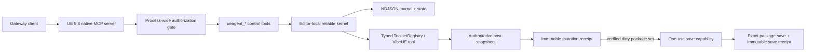

# UEAgent reliable execution contract

Protocol `2.0.0` is the writable UEAgent contract. It keeps Unreal's native MCP server and typed
tool registries, but moves mutation authority into one Editor-local C++ kernel. Gateway is the only
AI-facing client and may not bypass the kernel.

## Design trade-off

The implementation deliberately chooses one global logical writer, explicit scopes, durable
receipts, and separate save authorization. This gives up parallel mutation throughput in exchange
for predictable recovery and a small maintenance surface. Read-only work remains parallel outside
an active mutation; split the writer by scope only after typed UE operations themselves are proven
isolated.



There is no Python command runner, second MCP server, external broker, database, or resident CLI
worker in the mutation path.

## Fixed control surface

| Tool | Contract |
|---|---|
| `ueagent_state` | protocol, Editor epoch/PID, active/queued jobs, leases, dirty packages, last receipt, performance freeze |
| `ueagent_snapshot` | 1-64 authoritative package/object/editor snapshots with SHA-256; optional bounded property values |
| `ueagent_batch_read` | up to 64 state/snapshot/job/receipt reads in one round trip |
| `ueagent_submit` | durably accept and queue one typed mutation |
| `ueagent_get_job` | current job state or immutable terminal mutation receipt |
| `ueagent_cancel` | remove queued work or request active cancellation without releasing an uncertain lease early |
| `ueagent_save` | validate a receipt-issued capability and save exactly its package set |
| `ueagent_recover` | turn incomplete journals from an older Editor epoch into honest `RESULT_UNKNOWN` receipts |
| `ueagent_profile_gpu` | warm up/sample under a global performance freeze and return structured GPU evidence |

The MCP server gate allows these tools, discovery, and an explicit reviewed read-only allow-list.
All other direct or nested calls default to mutation and are rejected with
`RELIABLE_COMMAND_REQUIRED`. Authoritative domain reads pause while a mutation owns the Editor.

## Snapshot scopes

- Package: `/Game/Folder/Asset`
- Object: `object:/Game/Folder/Asset.Asset`
- Editor world: `editor:world`
- Selection: `editor:selection`
- Viewport: `editor:viewport`

Package/object snapshots include existence, resolved object/class, dirty state, save generation,
file size/timestamp when saved, a bounded reflected-property model, and a canonical SHA-256.
Missing targets produce deterministic `exists=false` snapshots, so create operations can use OCC.
One snapshot or canonical argument payload may not exceed 8 MiB.

## Mutation envelope

```json
{
  "command_id": "12345678-1234-1234-1234-1234567890ab",
  "target_type": "toolset",
  "toolset_name": "editor_toolset.toolsets.scene.SceneTools",
  "tool_name": "ExampleMutation",
  "arguments": {},
  "scopes": ["/Game/Folder/Asset"],
  "expected_snapshots": {
    "/Game/Folder/Asset": "<64-hex-authoritative-snapshot>"
  },
  "lease_mode": "scoped",
  "verify": "changed_or_noop",
  "timeout_ms": 120000,
  "allow_preexisting_dirty_save": false
}
```

`target_type` is `toolset` or `vibeue`. `lease_mode=exclusive` is reserved for operations that
cannot be scoped and may use only `verify=success`. Verification is one of `changed_or_noop`,
`changed`, `unchanged`, or `success`.

The command UUID is stable across transport retries. Canonical arguments, target, scopes,
expectations, and policy form its digest: replaying the same UUID/digest returns the existing job
or receipt; another digest is rejected. Canonical arguments at or above 64 KiB require
`payload_sha256`. UTF-8 attachments must stay under `Saved/UEAgent/Inbox`, declare their argument,
relative path, and SHA-256, and share the 8 MiB command limit.

## Execution and recovery

```text
accepted -> queued -> preflight -> waiting_external -> postflight -> terminal receipt
```

Acceptance and each transition append to `Saved/UEAgent/Operations/<command_id>.ndjson`. Preflight
rechecks only declared OCC expectations and acquires scoped or exclusive leases. Dirty-package and
package-save delegates detect undeclared write sets and out-of-band persistence. A deadline never
releases a still-uncertain lease or starts overlapping work.

A terminal receipt records four independent axes: tool outcome, observed effect, verification, and
persistence. Large results are externalized under `Saved/UEAgent/Evidence` with SHA-256. If the
Editor exits after durable acceptance but before a terminal receipt, the next epoch's
`ueagent_recover` writes `RESULT_UNKNOWN`; callers then perform authoritative readback before
deciding whether the same command identity is safe to replay.

## Save boundary

Managed service calls defer their former direct saves. Only a verified changed command can issue a
short-lived capability for the exact declared packages that became dirty. A package already dirty
at preflight is excluded unless `allow_preexisting_dirty_save=true` was explicit.

`ueagent_save` verifies the token signature, Editor epoch, expiry, one-use state, exact package set,
save generations, and current snapshots. It rejects active mutation/performance work and any extra
package save side effect. Replaying an already consumed token returns the original immutable save
receipt; it does not save again.

## Runtime files and trust

| Path | Meaning |
|---|---|
| `Saved/UEAgent/route.json` | machine-local stack identity and patch fingerprints |
| `Saved/UEAgent/state.json` | last-known kernel state; live only when its epoch matches a fresh doctor receipt |
| `Saved/UEAgent/Operations` | journals, mutation receipts, and save receipts |
| `Saved/UEAgent/Inbox` | hash-checked UTF-8 command attachments |
| `Saved/UEAgent/Evidence` | hash-addressed oversized tool/profile output |

Reflect Cache remains a disposable read model of saved assets. It may answer a cache-only read but
never supplies live OCC evidence, mutation completion, dirty-state truth, or save authority.
